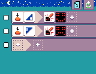

## Microsoft MicroCode [https://aka.ms/microcode](https://aka.ms/microcode)

Microsoft MicroCode is an icon-based programming language and editor for young learners to code with the [BBC micro:bit V2](https://microbit.org). MicroCode allows you to program the micro:bit V2 with only an [Arcade shield accessory](#arcade-shields-for-microbit-v2) - _no other computer is required!_ If you prefer the web browser, there's also a MicroCode web app that connects to your micro:bit V2 over WebUSB.

Here's the classic micro:bit _Happy-A-button/Sad-B-button_ program in MicroCode:

## Getting started

-   **Read the [MicroCode user guide](https://microsoft.github.io/microcode/docs/manual)**
-   [try it now!](https://microsoft.github.io/microcode/)

## [Arcade shields](https://microsoft.github.io/microcode/docs/manual#arcade-shield) for micro:bit V2

There are various [Arcade shields](https://microsoft.github.io/microcode/docs/manual#arcade-shield) available on the market today, as shown below.

</img>

## Robot

MicroCode can also be used to [program and control a 2 wheeled rover robot](https://microsoft.github.io/microcode/docs/robot).

{:class="sample"}

</img>

## Development

To contribute to MicroCode, please read about [MicroCode development](./docs/develop.md).

## Contributing

This project welcomes contributions and suggestions. Most contributions require you to agree to a
Contributor License Agreement (CLA) declaring that you have the right to, and actually do, grant us
the rights to use your contribution. For details, visit https://cla.opensource.microsoft.com.

When you submit a pull request, a CLA bot will automatically determine whether you need to provide
a CLA and decorate the PR appropriately (e.g., status check, comment). Simply follow the instructions
provided by the bot. You will only need to do this once across all repos using our CLA.

This project has adopted the [Microsoft Open Source Code of Conduct](https://opensource.microsoft.com/codeofconduct/).
For more information see the [Code of Conduct FAQ](https://opensource.microsoft.com/codeofconduct/faq/) or
contact [opencode@microsoft.com](mailto:opencode@microsoft.com) with any additional questions or comments.

## Trademarks

This project may contain trademarks or logos for projects, products, or services. Authorized use of Microsoft
trademarks or logos is subject to and must follow
[Microsoft's Trademark & Brand Guidelines](https://www.microsoft.com/en-us/legal/intellectualproperty/trademarks/usage/general).
Use of Microsoft trademarks or logos in modified versions of this project must not cause confusion or imply Microsoft sponsorship.
Any use of third-party trademarks or logos are subject to those third-party's policies.
