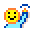

{:class="icon-sample"}

## How do I share my program?

From the web editor, copy the URL... it contains your whole program.

## How do I print my program?

Click the `screenshot` button at the bottom to get a rendered image of your program that you can share and print.

## How do I translate MicroCode?

Checkout the [localization](./localization) to see how you can help or use a localized build of MicroCode.
