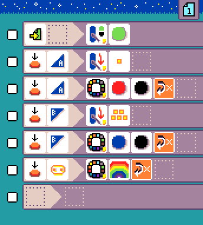

{:class="screenshot"}

MicroCode will detect [Jacdac](https://aka.ms/jacdac) modules and automatically display tiles for some of them. Tiles are available for all modules in [Kittenbot Jacdac Kit A](https://microsoft.github.io/jacdac-docs/devices/kittenbot/jacdacstarterkitawithjacdaptorformicrobitv2v10/),
as as well as the [Forward Education Climate Kit](https://microsoft.github.io/jacdac-docs/devices/forward-education/climateactionkitv10/). Many of the modules in [Kittenbot Jacdac Kit B](https://microsoft.github.io/jacdac-docs/devices/kittenbot/jacdacdeveloperstoolelectronicmodulekitbv10/) also are supported.

Programming tiles for Jacdac modules appear in the user interface when the modules are connected to the shield. The Jacdac tiles have a small yellow square in the lower-right corner.

### WHEN modules

#### Sensors

-   {:class="icon"} `magnet sensor` detects the presence of a magnet (levels 1 - 5, where 1 means no magnet present and 5 means strong presence of magnetic field)
-   {:class="icon"} `light sensor` measures the amount of light (levels 1 - 5, where 1 means little light present and 5 means a lot of light present)
-   {:class="icon"}
    measures the amount of moisture (levels 1 - 5, where 1 means very dry and 5 means very wet)
-   {:class="icon"} `distance sensor` measures the distance to an object (levels 1 - 5, where 1 means very close and 5 means far away)
-   {:class="icon"} `line sensor` detects
    whether the surface under the sensor is dark or light

#### User inputs

-   {:class="icon"} `slider` measures the position of a physical slider (1-5, where 1 is minimum position and 5 is maximum position)
-   {:class="icon"} `dial` has two associated events: turn left {:class="icon"} and turn right {:class="icon"}
-   {:class="icon"} `key` is available in the press/release event.

### DO modules

-   {:class="icon"} `LED` set a color animation on a programmable LED strip
-   {:class="icon"} `relay` controls a relay switch (turning it on or off)
-   {:class="icon"} `servo power` controls the power to a servo motor (turning it on or off)
-   {:class="icon"} `set servo angle` controls the orientation of a servo motor arm. The {:class="icon"} `servo` arm orientation is mapped to the wall clock hours: `0` (or `12`) is on rotated 90 degree from the resting position to the left, `6` is rotated 90 degree right from the rest position. This operation depends on the servo being powered on.
