The MicroCode language is defined in terms of **pages**, where a page has a list of **rules**,
and each rule consists of a **When** section and a **Do** section, each with a list of programming
**tiles**.

MicroCode supports events, conditions on the events, sequencing,
loops, variables, and simple arithmetic (addition, for now) over constants and variables.
See [samples](./samples) for a list of annotated examples.

The picture below shows a 1-page program with four rules.

{:class="screenshot"}

The first two rules run when A is pressed.

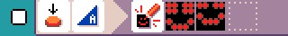{:class="rule"}

-   **when** {:class="icon"} press {:class="icon"} button A, **do** {:class="icon"} show image smiley.

{:class="rule"}

-   **when** {:class="icon"} press {:class="icon"} button A, **do** {:class="icon"} play sound emoji {:class="icon"} happy.

The other rules are similar but trigger for button B.

## Pages {#pages}

Execution of the MicroCode program starts on {:class="icon"} page 1. All the rules on that page are active.
Rules on another page only become active when the program switches to that page
(via an explicit 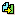{:class="icon"} switch-page command, discussed later).

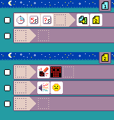{:class="screenshot"}

## WHEN section {#when}

The left-hand side of a rule, the `When` section, starts with an
**event** tile from the following dialog, which appears when you select the leftmost empty tile of a rule:

{:class="screenshot"}

-   {:class="icon"} `press` of button, micro:bit icon, or pin
-   {:class="icon"} `release` of button, micro:bit icon, or pin
-   {:class="icon"} `move` of accelerometer, in various ways
-   {:class="icon"} `hear` a sound, either loud or soft
-   {:class="icon"} `radio receive` of a number
-   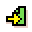{:class="icon"} `start page` only runs when the page is started (or switched to), with an optional delay
-   {:class="icon"} `timer` of a time
-   {:class="icon"} {:class="icon"} {:class="icon"} `variable (X,Y,Z) changed` to a number

If the `when` section is left empty,
the rule will run once when the page is started.

### Event parameters and conditions

An event tile can be followed by none, one or more parameter tiles which determines the conditions under which execution will proceed from the **When** section to the **Do** section, Every event has a default parameter, which is used when no parameter is specified. The defaults are:

-   {:class="icon"} `press`, defaults to `button A` {:class="icon"};
    other options include `button B` {:class="icon"},
    `micro:bit logo` {:class="icon"},
    `pin 0` {:class="icon"},
    `pin 1` {:class="icon"}, `pin 2` {:class="icon"}
-   {:class="icon"} `release`, defaults and options are the same as for `press`

The dialog below shows the parameters associated with the button press/release events.

{:class="screenshot"}

-   {:class="icon"} `move`, defaults to {:class="icon"} `shake`; other options include 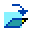{:class="icon"} `tilt up`, {:class="icon"} `tilt down`, {:class="icon"} `tilt left` and {:class="icon"} `tilt right`
-   {:class="icon"} `hear`, defaults to 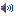{:class="icon"}`loud`
-   {:class="icon"} `radio receive`, defaults to `any`
-   {:class="icon"} `timer`, defaults to `1/4 second`
-   {:class="icon"} `variable (X,Y,Z) changed`, defaults to `any` (any value change triggers it)

### Conditions on event values

When an event carries a numeric value (in the case of receiving a radio message or a variable being updated), if that value is equal to the number of dots that follows, in total, then execution will proceed to the DO section. Here are the five available (dot) values:

-   `1 dot` 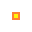{:class="icon"}
-   `2 dots`: 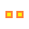{:class="icon"}
-   `3 dots`: {:class="icon"}
-   `4 dots`: 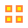{:class="icon"}
-   `5 dots`: 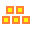{:class="icon"}

The `timer` is parameterized with various times that can also be sequenced and summed:

-   `1/4 second`: {:class="icon"}
-   `1 second`: 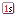{:class="icon"}
-   `5 seconds`: 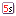{:class="icon"}
-   `? seconds`: 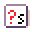{:class="icon"} - 0 to 1 second, chosen randomly

In the case of the timer, the sum specifies the amount of time to start the timer with.

{:class="screenshot"}

## DO section {#do}

The right-hand side of a rule, the **Do** section, starts with a
**command** tile from the following list:

-   {:class="icon"} `show image` shows an animation sequence on the LED screen.
-   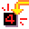{:class="icon"} `show number` shows a numeric value between 0 and 99
-   {:class="icon"} `sound emoji` plays a sequence of emojis
-   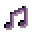{:class="icon"} `play notes` plays a sequence of notes (from the C major scale)
-   {:class="icon"} `radio send` sends a given number over the radio
-   {:class="icon"} `radio set group` takes a number and ensures that radio messages from a different group number are ignored (the default radio group is 1, which means all micro:bits see all messages)
-   {:class="icon"} `switch page` transfers execution control to a given page
-   {:class="icon"} `set variable` puts a number into a variable (`X`, `Y`, `Z`); defaults to 0 if no value specified

A command can be followed by various parameter tiles, depending on the type
of command. As with events, every command has a default parameter, for the
case where no parameter tile is given:

-   {:class="icon"} `screen` shows a `happy face` by default
-   {:class="icon"} `sound emoji` plays {:class="icon"} `giggle` by default
-   {:class="icon"} `radio send` sends the number `1` by default
-   {:class="icon"} `switch page` switches to page `1` by default
-   {:class="icon"} `get variable` gets the number from a variable (`X`, `Y`, `Z`); defaults to `0` if variable wasn't previously set.
    Sequences of numeric parameters are summed, as before, allowing the construction of values greater than `5 dots`.

### Asset editors

Two editors are provided to allow the creation of 5x5 LED images and simple melodies.

#### LED image editor

THe LED image editor lets you select which LEDs are on/off for a frame of an animation. You can continue to add LED images in a sequence (the editor will make a copy of the last image):

<video class="sample" poster="./videos/ledFieldEditor.png" src="./videos/ledFieldEditor.mp4" controls="true"></video>

#### Melody editor

The melody editor lets you compose a four note sequence, where each note can be C,D,E,F, or G:

<video class="sample" poster="./videos/melodyFieldEditor.png" src="./videos/melodyFieldEditor.mp4" controls="true"></video>

### Constructing numbers

For commands that expect a numeric value ({:class="icon"} `radio send`, {:class="icon"} `set variable`), a variety of tiles are available

-   the **constant values** {:class="icon"} 1, 2, 3, 4 and 5 dots
-   the **values of variables** {:class="icon"} `X`, `Y`, and `Z`
-   the **value of the radio receive event** {:class="icon"}, only available if **WHEN** section has radio receive event {:class="icon"}
-   a {:class="icon"} **random number generator** yields a random integer between `1` and `5` (inclusive) by default

### 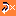{:class="icon"} `repeat` (loops) {#loops}

A {:class="icon"} `repeat` tile
can be added to certain commands to repeat the entire **DO** section. The value tiles
after `repeat` determine the number of iterations. If no value is given, it repeats forever.

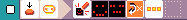{:class="rule"}

-   **when** {:class="icon"} press {:class="icon"} micro:bit logo, **do** {:class="icon"} show image happy animation and {:class="icon"} repeat {:class="icon"} 3 times.

## Accessories (Jacdac Modules) {#jacdac}

MicroCode will detect [Jacdac](https://aka.ms/jacdac) module and automatically display tiles for some of them.

### WHEN modules

-   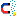{:class="icon"} `magnet detector` detects the presence of a magnet,

### DO modules

-   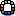{:class="icon"} `LED` set a color animation on a programmable LED strip
-   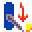{:class="icon"} `servo` controls the orientation of a servo motor arm. The {:class="icon"} `servo` arm orientation is mapped to the wall clock hours: `0` (or `12`) is on rotated 90 degree from the resting position to the left, `6` is rotated 90 degree right from the rest position.
