The MicroCode language is defined in terms of **pages**, where a page has a list of **rules**,
and each rule consists of a **When** section and a **Do** section, each with a list of programming
**tiles**.

MicroCode supports events, conditions on the events, sequencing,
loops, variables, and simple arithmetic (addition, for now) over constants and variables.
See [samples](./samples) for a list of annotated examples.

The picture below shows a 1-page program with four rules.

{:class="screenshot"}

The first two rules run when A is pressed.

{:class="rule"}

-   **when** {:class="icon"} press {:class="icon"} button A, **do** {:class="icon"} show image smiley.

{:class="rule"}

-   **when** {:class="icon"} press {:class="icon"} button A, **do** {:class="icon"} play sound emoji 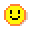{:class="icon"} happy.

The other rules are similar but trigger for button B.

## Pages and rule execution {#pages}

Execution of the MicroCode program starts on {:class="icon"} page 1. All the rules on that page are active. Rules on another page only become active when the program switches to that page
(via an explicit {:class="icon"} switch-page command, discussed later).
Any rules that might still be executing on the current page (like an animation in a loop) are terminated before
the page switch takes place (you can never have rules from different pages executing at the same time).

{:class="screenshot"}

### Events and rule ordering

Events are processed by MicroCode one at a time. For example, if you push the A and B buttons at (roughly)
the same time, then MicroCode will process either A before B or it will process B before A.
Given an event, MicroCode processes the event by executing the rules for that event in the
order they appear on the current page. For each rule, this means evaluating if the conditions
on the event in the `When` section hold and, if so, starting the rule's `Do` section.

### Rule termination

Most of the commands in the `Do` section complete quickly, such as assigning a value to a variable;
others, like the display of a sequence of images take time proportional to sequence's length;
furthermore, an animation or sound sequence can be repeated multiple times
(or without bound) using a repeat tile. In the case of an animation, a currently
running rule that is using the micro:bit screen
will be terminated if a new rule that also uses the micro:bit screen is started.

## WHEN section {#when}

The left-hand side of a rule, the `When` section, starts with an
**event** tile from the following dialog, which appears when you select the leftmost empty tile of a rule:

{:class="screenshot"}

-   {:class="icon"} `press` of button, micro:bit icon, or pin
-   {:class="icon"} `release` of button, micro:bit icon, or pin
-   {:class="icon"} `move` of accelerometer, in various ways
-   {:class="icon"} `hear` a sound, either loud or soft
-   {:class="icon"} `temperature change`, either `warmer` or `colder`
-   {:class="icon"} `radio receive` of a number
-   {:class="icon"} `start page` only runs when the page is started (or switched to), with an optional delay
-   {:class="icon"} `timer` of a time
-   {:class="icon"} 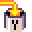{:class="icon"} {:class="icon"} `variable (X,Y,Z) changed` to a number

If the `when` section is left empty,
the rule will run once when the page is started.

### Event parameters and conditions

An event tile can be followed by none, one or more parameter tiles which determines the conditions under which execution will proceed from the **When** section to the **Do** section, Every event has a default parameter, which is used when no parameter is specified. The defaults are:

-   {:class="icon"} `press`, defaults to `button A` {:class="icon"};
    other options include `button B` {:class="icon"},
    `micro:bit logo` {:class="icon"},
    `pin 0` {:class="icon"},
    `pin 1` {:class="icon"}, `pin 2` {:class="icon"}
-   {:class="icon"} `release`, defaults and options are the same as for `press`

The dialog below shows the parameters associated with the button press/release events.

{:class="screenshot"}

-   {:class="icon"} `move`, defaults to {:class="icon"} `shake`; other options include {:class="icon"} `tilt up`, 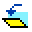{:class="icon"} `tilt down`, {:class="icon"} `tilt left` and 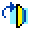{:class="icon"} `tilt right`
-   {:class="icon"} `hear`, defaults to {:class="icon"}`loud`
-   {:class="icon"} `temperature change`, either 1 degree (Celcius) `warmer`
    {:class="icon"} or `colder`
    {:class="icon"}
    (defaults to `warmer`)

-   {:class="icon"} `radio receive`, defaults to `any`
-   {:class="icon"} `timer`, defaults to `1/4 second`
-   {:class="icon"} `variable (X,Y,Z) changed`, defaults to `any` (any value change triggers it)

### Conditions on event values

When an event carries a numeric value (in the case of receiving a radio message or a variable being updated), if that value is equal to the sum of the values (constants and variables) that follows, then execution will proceed to the DO section. Here are the five available (dot) values:

-   `1 dot` {:class="icon"}
-   `2 dots`: {:class="icon"}
-   `3 dots`: {:class="icon"}
-   `4 dots`: {:class="icon"}
-   `5 dots`: {:class="icon"}

The `timer` is parameterized with various times that can also be sequenced and summed:

-   `1/4 second`: 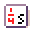{:class="icon"}
-   `1 second`: 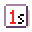{:class="icon"}
-   `5 seconds`: {:class="icon"}
-   `? seconds`: {:class="icon"} - 0 to 1 second, chosen randomly

In the case of the timer, the sum specifies the amount of time to start the timer with.

{:class="screenshot"}

## DO section {#do}

The right-hand side of a rule, the **Do** section, starts with a
**command** tile from the following list:

-   {:class="icon"} `show image` shows an animation sequence on the LED screen.
-   {:class="icon"} `show number` shows a numeric value between 0 and 99
-   {:class="icon"} `sound emoji` plays a sequence of emojis
-   {:class="icon"} `play notes` plays a sequence of notes (from the C major scale)
-   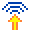{:class="icon"} `radio send` sends a given number over the radio
-   {:class="icon"} `radio set group` takes a number and ensures that radio messages from a different group number are ignored (the default radio group is 1, which means all micro:bits see all messages)
-   {:class="icon"} `switch page` transfers execution control to a given page
-   {:class="icon"} `set variable` puts a number into a variable (`X`, `Y`, `Z`); defaults to 0 if no value specified; also 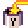{:class="icon"} and 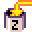{:class="icon"}

A command can be followed by various parameter tiles, depending on the type
of command. As with events, every command has a default parameter, for the
case where no parameter tile is given:

-   {:class="icon"} `screen` shows a `happy face` by default
-   {:class="icon"} `sound emoji` plays {:class="icon"} `giggle` by default
-   {:class="icon"} `radio send` sends the number `1` by default
-   {:class="icon"} `switch page` switches to page `1` by default
-   {:class="icon"} `get variable` gets the number from a variable (`X`, `Y`, `Z`); defaults to `0` if variable wasn't previously set. Also
    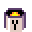{:class="icon"}
    and 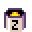{:class="icon"}

### Asset editors

Two editors are provided to allow the creation of 5x5 LED images and simple melodies.

#### LED image editor

THe LED image editor lets you select which LEDs are on/off for a frame of an animation. You can continue to add LED images in a sequence (the editor will make a copy of the last image):

<video class="sample" poster="./videos/ledFieldEditor.png" src="./videos/ledFieldEditor.mp4" controls="true"></video>

#### Melody editor

The melody editor lets you compose a four note sequence, where each note can be C,D,E,F, or G:

<video class="sample" poster="./videos/melodyFieldEditor.png" src="./videos/melodyFieldEditor.mp4" controls="true"></video>

### Constructing numbers

For commands that expect a numeric value ({:class="icon"} `radio send`, {:class="icon"} `set variable`), a variety of tiles are available

-   the **constant values** {:class="icon"} 1, 2, 3, 4 and 5 dots
-   the **values of variables** {:class="icon"} `X`, `Y`, and `Z`
-   the **value of the radio receive event** 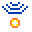{:class="icon"}, only available if **WHEN** section has radio receive event {:class="icon"}
-   the **value of the temperature sensor** 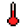{:class="icon"}, always available
-   a {:class="icon"} **random number generator** yields a random integer between `1` and `5` (inclusive) by default

### {:class="icon"} `repeat` (loops) {#loops}

A {:class="icon"} `repeat` tile
can be added to certain commands to repeat the entire **DO** section. The value tiles
after `repeat` determine the number of iterations. If no value is given, it repeats forever.

{:class="rule"}

-   **when** {:class="icon"} press {:class="icon"} micro:bit logo, **do** {:class="icon"} show image happy animation and {:class="icon"} repeat {:class="icon"} 3 times.

## Jacdac Modules {#jacdac}

MicroCode will detect [Jacdac](https://aka.ms/jacdac) modules and automatically display tiles for some of them. Tiles are available for all modules in [Kittenbot Jacdac Kit A](https://microsoft.github.io/jacdac-docs/devices/kittenbot/jacdacstarterkitawithjacdaptorformicrobitv2v10/). Tiles appear when the modules are connected.

### WHEN modules

#### Sensors

-   {:class="icon"} `magnet sensor` detects the presence of a magnet (levels 1 - 5, where 1 means no magnet present and 5 means strong presence of magnetic field)
-   {:class="icon"} `light sensor` measures the amount of light (levels 1 - 5, where 1 means little light present and 5 means a lot of light present)

#### User inputs

-   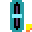{:class="icon"} `slider` measures the position of a physical slider (1-5, where 1 is minimum position and 5 is maximum position)
-   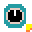{:class="icon"} `dial` has two associated events: turn left {:class="icon"} and turn right 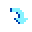{:class="icon"}
-   {:class="icon"} `key` is available in the press/release event.

### DO modules

-   {:class="icon"} `LED` set a color animation on a programmable LED strip
-   {:class="icon"} `servo` controls the orientation of a servo motor arm. The {:class="icon"} `servo` arm orientation is mapped to the wall clock hours: `0` (or `12`) is on rotated 90 degree from the resting position to the left, `6` is rotated 90 degree right from the rest position.

## Robot {#robot}

microcode can be used to control a micro:bit robot ([read more](./robot)).

Make to start your program by setting the same radio group as the robot.

{:class="rule"}

### DO section

The robot motor commands start with a car and a sequence of move directions.

-   {:class="icon"} `robot`, start the robot motor commands
-   {:class="icon"} `forward`, instructs the robot to move forward.
-   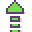{:class="icon"} `fast forward`, instructs the robot to move forward at maximum speed
-   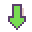{:class="icon"} `reverse`, instructs the robot to move backward
-   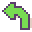{:class="icon"} `turn left`, instructs the robot to turn left
-   {:class="icon"} `spin left`, instructs the robot to spin left
-   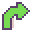{:class="icon"} `turn right`, instructs the robot to turn right.
-   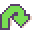{:class="icon"} `spin right`, instructs the robot to spin right
-   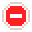{:class="icon"} `stop`, instructs the robot to stop

Additionally to motors, the robot had LEDs that can be controlled as well.

-   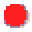{:class="icon"} `LED red`, turns LED to red
-   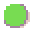{:class="icon"} `LED green`, turns LED to green
-   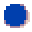{:class="icon"} `LED blue`, turns LED to blue

The forward, backward, left, right and stop blocks
can be sequenced in the same rule.

{:class="rule"}

The robot will automatically slow down when it detects a line; unless you are running it in
fast forward. This greatly stabilizes line following algorithms.

### WHEN section

The robot distance sensor
is exposed as a wall tile;
and the line sensor as a line tile.

-   {:class="icon"} `wall detected`, triggers when an obstacle is detected;
    (levels 1 - 5, where 1 means obstacle close, 5 means far away in multiple of 5cm)

Line detection is typically done with two infrared sensors under the robot.

-   {:class="icon"} `line change detected`

There are 3 cases when a line is detected:

-   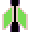{:class="icon"} both,
-   {:class="icon"} left,
-   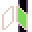{:class="icon"} right.

There are 3 possible state when the line detector is not detected:

-   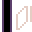{:class="icon"} no line detected coming from a left line,
-   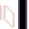{:class="icon"} no line detected coming from a right line,
-   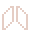{:class="icon"} no line detected
    coming from both lines,
