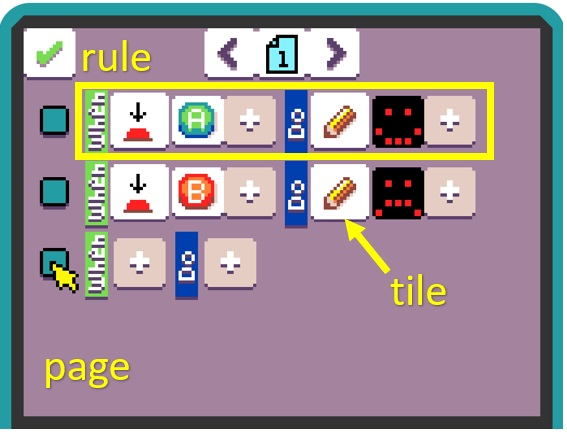

# MicroCode Language

The MicroCode language is defined in terms of pages, where a page has a list of rules,
and each rule consists of a **When** section and a **Do** section, each with a list of programming
**tiles**. The **When** section begins with a **sensor** tile, followed optionally by one or more
**filters** on the sensor. The **Do** section begins with an **actuator** (or **action**), followed optional by one
or **modifiers** to the actuator/action.

The picture above shows a 1-page program with two rules:

-   the first rule shows a happy face on the micro:bit screen when the A button is pressed
-   the second rule shows a sad face when the B button is pressed.

## Pages

Execution of the MicroCode program starts on page 1. All the rules on that page are active.Rules on another page only become active when the program switches to that page (via an explicit switch-page action, discussed later).

## Rules and Informal Semantics

The rules on a page fire in parallel, so if you want to have two different actions take place
on the press of A button, you would have two rules with the same When section (A button is pressed),
but different actions. If the actions of the two rules use the same resource (for example, both actions
show something on the micro:bit screen), then the last rule in order from top to bottom wins. That is,
the order of the rules only matters when different rules act on the same resource.

### Sensors

A sensor tile can refer to a hardware feature as simple as a button,
a thermometer represented by a floating point (or fixed point) value, or an accelerometer with a set of possible events. A sensor could also refer to a GPIO pin, a timer, microphone, radio, or other means for the program to receive notification of a state change or an event.

In the program above, the sensor refers to a press/touch event, without reference to the particular hardware feature (see filters below).

### Filters

Filters follow a sensor and specify conditions under which program execution can proceed to the **Do** section.  
If no filters are present, each sensor tile has a default filter that determines whether or not execution
proceeds. For example, if the sensor tile refers to a press event, with no following filter, the default filter will recognize any the press of any button.
If, on the other hand, a filter following the press event specifies a particular
button (such as A or B, in the program above), execution will proceed to the **Do** only when the given button is pressed.

The picker menu above shows the range of micro:bit hardware features that can generate a press event.

### Actuators

Actuators represent actions that can change the state of the device, by writing to the screen, sending
a message, playing a sound, etc.

### Modifiers
