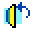
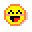

# MicroCode Language

The MicroCode language is defined in terms of **pages**, where a page has a list of **rules**,
and each rule consists of a **When** section and a **Do** section, each with a list of programming
**tiles**.

MicroCode supports events, conditions on the events, sequencing,
loops, and variables.

The picture below shows a 1-page program with two rules.

{:class="screenshot"}

The first rule shows a happy face on the micro:bit screen when the button A is pressed.

-   **when** {:class="icon"} press {:class="icon"} button A, **do** {:class="icon"} paint screen with smiley.

The second rule shows a sad face when the button B is pressed.

-   **when** {:class="icon"} press {:class="icon"} button B, **do** {:class="icon"} paint screen with frowney.

## Pages {#pages}

Execution of the MicroCode program starts on {:class="icon"} page 1. All the rules on that page are active.
Rules on another page only become active when the program switches to that page
(via an explicit {:class="icon"} switch-page action, discussed later).

{:class="screenshot"}

## Rules and conflicts {#rules}

The rules on a page fire in parallel, so if you want to have two different actions take place
on the press of A button, you would have two rules with the same When section (A button is pressed),
but different actions. If the actions of the two rules use the same resource (for example, both actions
show something on the micro:bit screen), then the last rule in order from top to bottom wins. That is,
the order of the rules only matters when different rules act on the same resource.

## WHEN section {#when}

The left-hand side of a rule, the `When` section, starts with an
**event** tile from the following dialog, which appears when you select the leftmost empty tile of a rule:

{:class="screenshot"}

-   {:class="icon"} `press` of button, micro:bit icon, or pin
-   {:class="icon"} `release` of button, micro:bit icon, or pin
-   {:class="icon"} `move` of accelerometer, in various ways
-   {:class="icon"} `hear` a sound, either loud or soft
-   {:class="icon"} `radio receive` of a number
-   {:class="icon"} `repeat timer` of a time
-   {:class="icon"} {:class="icon"} {:class="icon"} `variable (A,B,C) changed` to a number

If the `when` section is left section,
the rule will run once when the page is started.

### Event parameters and conditions

An event tile can be followed by none, one or more parameter tiles which determines the conditions under which execution will proceed from the **When** section to the **Do** section, Every event has a default parameter, which is used when no parameter is specified. The defaults are:

-   {:class="icon"} `press`, defaults to `button A` {:class="icon"};
    other options include `button B` {:class="icon"},
    `micro:bit logo` {:class="icon"},
    `pin 0` {:class="icon"},
    `pin 1` {:class="icon"}, `pin 2` {:class="icon"}
-   {:class="icon"} `release`, defaults and options are the same as for `press`

The dialog below shows the parameters associated with the button press/release events.

{:class="screenshot"}

-   {:class="icon"} `move`, defaults to {:class="icon"} `shake`; other options include {:class="icon"} `tilt up`, {:class="icon"} `tilt down`, {:class="icon"} `tilt left` and {:class="icon"} `tilt right`
-   {:class="icon"} `hear`, defaults to {:class="icon"}`loud`
-   {:class="icon"} `radio receive`, defaults to `any`
-   {:class="icon"} `repeat timer`, defaults to `1/4 second`
-   {:class="icon"} `variable (A,B,C) changed`, defaults to `any` (any value change triggers it)

### Conditions on event values

When an event carries a numberic value (in the case of receiving a radio message or a variable being updated), if that value is equal to the sum of coins, then execution will proceed to the DO section. Here are the five available coins:

-   `1` {:class="icon"}
-   `2`: {:class="icon"}
-   `3`: {:class="icon"}
-   `5`: {:class="icon"}
-   `10`: {:class="icon"}

The repeat timer is parameterized with various times that can also be sequenced and summed:

-   `1/4 second`: {:class="icon"}
-   `1 second`: {:class="icon"}
-   `5 seconds`: {:class="icon"}
-   `? seconds`: {:class="icon"} - 0 to 1 second, chosen randomly

In the case of the timer, the sum specifies the amount of time to start the timer with.

## DO section {#do}

The right-hand side of a rule, the **Do** section, starts with an
**command** tile from the following list:

-   {:class="icon"} `screen` shows an animation sequence on the LED screen.
-   {:class="icon"} `sound emoji` plays a given emoji
-   {:class="icon"} `radio send` sends a given number over the radio
-   {:class="icon"} `switch page` transfers execution control to a given page
-   {:class="icon"} `set variable` puts a number into a variable (A, B, C)

A command can be followed by various parameter tiles, depending on the type
of command. As with events, every command has a default parameter, for the
case where no parameter tile is given:

-   {:class="icon"} `screen` shows a `happy face` by default
-   {:class="icon"} `sound emoji` plays {:class="icon"} `giggle` by default
-   {:class="icon"} `radio send` sends the number `1` by default
-   {:class="icon"} `switch page` switches to page `1` by default
-   {:class="icon"} `set variable` puts a number into a variable (A, B, C)

Sequences of numeric parameters are summed, as before, allowing the construction of values greater than `5`.

{:class="screenshot"}

### Constructing numbers

For commands that expect a numeric value ({:class="icon"} `radio send`, {:class="icon"} `set variable`), a variety of tiles are available

-   the **constant values** {:class="icon"} 1, 2, 3, 5, and 10 (maybe we'll add 0 soon)
-   the **values of variables** {:class="icon"} A, B, and C
-   a {:class="icon"} **random number generator** yields a random integer between `1` and `5` (inclusive) by default

## Jacdac Modules {#jacdac}

MicroCode will detect [Jacdac](https://aka.ms/jacdac) module and automatically display tiles for some of them.

### WHEN modules

-   {:class="icon"} `magnet detector` detects the presence of a magnet,

### DO modules

-   {:class="icon"} `LED` set a color animation on a programmable LED strip
-   {:class="icon"} `servo` controls the orientation of a servo motor arm. The {:class="icon"} `servo` arm orientation is mapped to the wall clock hours: `0` (or `12`) is on rotated 90 degree from the resting position to the left, `6` is rotated 90 degree right from the rest position.
