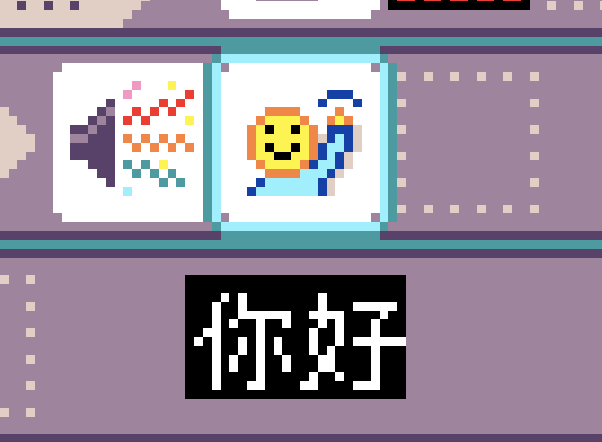

# Localizing MicroCode

{:class="screenshot"}

You can point directly to a localized by doing `/<icodecode>` like `/fr` (case-sensitive).

The list of supported languages is available
in the [User Guide](./manual).

## Getting started

The localization is handled through [Crowdin](https://crowdin.com). You will need to get a translator account to get started.

-   **[translate all strings](https://crowdin.com/translate/makecode/12054)**

Once your translations are added, someone will have to approve if you are a proofreader, go ahead and approve them. Then send us a comment on the crowdin message board to refresh the build.
