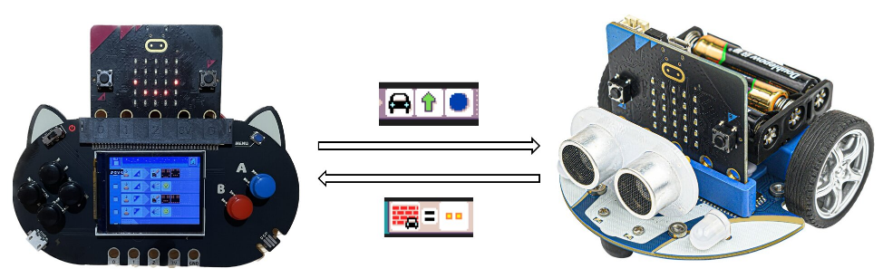



MicroCode makes it possible to program the [micro:bit V2](https://microbit.org)
**without the need for an extra computer or Internet connection**.
As shown above, the micro:bit slots into a (commercially available) shield that provides a color display and extra inputs. 
The MicroCode visual programming model is based on Kodu and targets children age 6-9, younger than the traditional audience for the micro:bit. MicroCode features:

-   [arcade shields](#arcade-shields) for the micro:bit V2 enable "on the go" programming with familiar game console controls
-   kid-friendly, icon-based, structured code editor and [programming language](./language)
-   lots of [sample programs](./samples) to get started
-   [translated](#localization) in 20+ languages
-   remote control a [micro:bit robot](./robot) using MicroCode
    to follow lines, avoid obstacles and more.
-   extend and program your creation with [Jacdac accessories](#jacdac) (LEDs, servos, ...)

## Getting started

Regardless of whether you are using the Arcade shield or web app, you first need to download the (localized) MicroCode hex file to your micro:bit V2. There are two ways to do this:

1. visit the [web app](https://microsoft.github.io/microcode/) and follow directions to connect your micro:bit and [automatically download over WebUSB](#download)
2. visit the [localization](#localization) section to _download_ the MicroCode hex file to your computer and copy to your micro:bit V2 (plugged into your computer via USB).

## Arcade shields {#arcade-shield}

Three Arcade shields for the micro:bit V2 are available on the market today, as shown below. After downloading the MicroCode hex file to your micro:bit V2, whenever you plug the micro:bit into the Arcade Shield, MicroCode should start running. Your MicroCode program is always live and runnable. Once you remove the micro:bit from the shield, the program will persist and continue to run (assuming the micro:bit is still powered, of course).

<table>
<tr valign="top">
<td width="33%" >
<a href="https://www.kittenbot.cc/products/newbit-arcade-shield">
Kittenbot's newbit Arcade shield
</a>
</td><td width="33%" >
<a href="https://shop.elecfreaks.com/products/micro-bit-retro-programming-arcade">
ELECFREAK's micro:bit Arcade shield
</a>
</td>
<td width="33%" >
<a href="https://www.icshop.com.tw/products/368112100137?locale=en">
ICShopping's Game:bit Arcade shield
</a>
</td></tr>
<tr>
<td>

</td><td>

</td><td>

</td></tr>
<tr valign="top">
<td>

Small screen. No battery or battery pack included. 3.7V JST power jack on back. One <a href="https://aka.ms/jacdac">Jacdac</a> port.

</td>

<td>

Assembly required. Small screen. AAA Battery pack on back. One <a href="https://aka.ms/jacdac">Jacdac</a> port.

</td>
<td>

No assembly required. Large screen and 3d-printed enclosure with LiPo battery inside. Two <a href="https://aka.ms/jacdac">Jacdac</a> ports.

</td>
</tr>

</table>

## micro:bit Robots {#robots}

Remote control a [micro:bit robot](./robot) using MicroCode
to follow lines, avoid obstacles and more.

[{:class="photo"}](./robot)

## Accessories {#jacdac}

MicroCode supports accessories to extend the micro:bit device with LEDs, servos, motors, ...
In this video, we launch an LED animation when a clap is detected. The accessories are powered by [Jacdac](https://microsoft.github.io/jacdac-docs).

<video class="sample" poster="./videos/jacdac-led.png" src="./videos/jacdac-led.mp4" controls="true"></video>

## Localization {#localization}

MicroCode is community translated through Crowdin. Please read on [localization](./localization) to get started.

-   [Basque](../eu.html) ([download](../assets/hex/microcode-eu.hex))
-   [Catalan](../ca.html) ([download](../assets/hex/microcode-ca.hex))
-   [Chinese (Simplified)](../zh-CN.html) ([download](../assets/hex/microcode-zh-cn.hex))
-   [Chinese (Traditional))](../zh-HK.html) ([download](../assets/hex/microcode-zh-hk.hex))
-   [Croatian](../hr.html) ([download](../assets/hex/microcode-hr.hex))
-   [Dutch](../nl.html) ([download](../assets/hex/microcode-nl.hex))
-   [English](../) ([download](../assets/hex/microcode-en.hex))
-   [German](../de.html) ([download](../assets/hex/microcode-de.hex))
-   [Filipino](../fil.html) ([download](../assets/hex/microcode-fil.hex))
-   [French](../fr.html) ([download](../assets/hex/microcode-fr.hex))
-   [French (Canada)](../fr-CA.html) ([download](../assets/hex/microcode-fr-ca.hex))
-   [Italian](../it.html) ([download](../assets/hex/microcode-it.hex))
-   [Japanese](../ja.html) ([download](../assets/hex/microcode-ja.hex))
-   [Korean](../ko.html) ([download](../assets/hex/microcode-ko.hex))
-   [Polish](../pl.html) ([download](../assets/hex/microcode-pl.hex))
-   [Portuguese (Brazil)](../pt-BR.html) ([download](../assets/hex/microcode-pt-br.hex))
-   [Russian](../ru.html) ([download](../assets/hex/microcode-ru.hex))
-   [Spanish](../es-ES.html) ([download](../assets/hex/microcode-es-es.hex))
-   [Spanish (Mexico)](../es-MX.html) ([download](../assets/hex/microcode-es-mx.hex))
-   [Turkish](../tr.html) ([download](../assets/hex/microcode-tr.hex))
-   [Welsh](../cy.html) ([download](../assets/hex/microcode-cy.hex))

## Web editor

<video class="sample" poster="./videos/smiley-buttons.png" src="./videos/smiley-buttons.mp4" controls="true"></video>

The MicroCode web editor is at [https://microsoft.github.io/microcode/](https://microsoft.github.io/microcode/).
We recommend using the keyboard navigation:

-   `Left`, `Right`, `Up`, `Down` moves the cursor
    -   the `Left` and `Right` keys will wrap around in the editor on the **same** page
    -   the `Up` key on top of the screen will act as `back`. It will go back the pages until page 1 is in focus, then pressing up will go back to the start screen.
    -   the `Down` key will wrap around the pages
-   `Enter` or `Space` for `A` button
-   `Backspace` for `B` button
-   `]` or `Page Up` to go to the next page, `[` or `Page Down` to go to the previous page
-   Copy the URL to share your program.

### Automatic download to micro:bit V2 {#download}

When the editor does not detect any micro:bit, it will automatically prompt you with instructions
on how to connect. Once your micro:bit V2 is paired, the web editor will be able to download your
MicroCode program to your micro:bit. This happens on every edit, so your program
is always up-to-date (and running)!

> If your micro:bit disconnects, you will see a micro:bit icon show up on the upper left corner of the editor. Click on that button to reconnect again.

### Accessibility

We want to make the editor as accessible as possible; please send us suggestions to improve its accessibility.

#### Keyboard navigation

MicroCode can be accessed with the keyboard:

-   Arrow keys to move cursor
-   `Enter` or `Space` for `A` button
-   `Backspace` for `B` button
-   Keep moving the cursor `Up` to go back a screen, if `Backspace` is not available;
    for example, if you are using a 5-input switch panel.
-   Keep moving `Right` or `Left` to wrap around the user interface; for example,
    if you are using a 2-input switch panel.

#### Gamepads

MicroCode supports game console controllers compatible with [Web Gamepad](https://developer.mozilla.org/en-US/docs/Web/API/Gamepad).

#### Screen reader

The editor integrates with existing screen readers, like NVDA.

#### Tooltip read aloud

By clicking on the `tooltip reader` button at the bottom of the editor, the tooltips will be read aloud. This may be useful for students who are still learning to read.

### Program slots    {#program-slots}

There are three slots for saving user programs for later load/restore. From the editor, click on the disk icon

in the upper left to select which slot to save the current program to. From the home screen, select the disk icon to load a program from one of the three save slots.

## Community

-   [KittenBot MicroCode introduction](https://mp.weixin.qq.com/s/yBQMU2IAbeHgr-ok05THTA)



-   Microsoft Garage for kick starting this project during the 2022 Microsoft Hackathon.
-   [@loretod101](https://twitter.com/loretod101) on advising on accessibility features, including switch access support.
-   [@BillSeiver](https://twitter.com/BillSiever) on feedback for tiles, including the `page start` tile
-   [@eliseli\_](https://twitter.com/eliseli_) for the Spanish translation

## Contributing

-   Post your suggestions or questions at [https://forum.makecode.com/c/60](https://forum.makecode.com/c/60).

This project is open source and welcomes contributions and suggestions at https://github.com/microsoft/microcode.
Read the [developer instructions](./develop.md).
