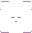
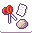
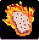
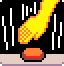
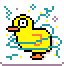
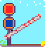
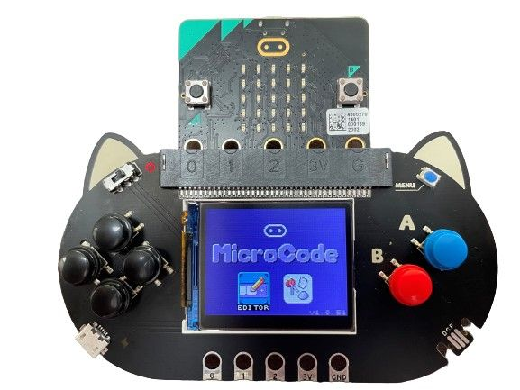

> MicroCode is still in **beta** development and might change in the future. Post your suggestions or questions on the [forum](https://forum.makecode.com/c/60).

Physical computing for young learners on the [micro:bit V2](https://microbit.org):

-   Kid-friendly, icon-based, structured code editor and [programming language](./language)
-   Live, the code is downloaded to the micro:bit on every edit
-   Cursor based navigation with keyboard (switch access compatible), mouse, touch, screen reader support
-   Accessories (LEDs, servos, ...) supported via [Jacdac](https://aka.ms/jacdac)

<video class="sample" poster="./videos/smiley-buttons.png" src="./videos/smiley-buttons.mp4" controls="true"></video>

## [Web editor](https://aka.ms/m9) {#web}

The MicroCode web editor is at [aka.ms/m9](https://aka.ms/m9). We recommend using the keyboard navigation.
MicroCode is designed to be friendly to switch access devices.

-   `Left`, `Right`, `Up`, `Down` moves the cursor
    -   the `Left` and `Right` keys will wrap around in the editor on the **same** page
    -   the `Up` key on top of the screen will act as `back`. It will go back the pages until page 1 is in focus, then pressing up will go back to the start screen.
    -   the `Down` key will wrap around the pages
-   `Enter` or `Space` for `A` button
-   `Backspace` for `B` button
-   `]` or `Page Up` to go to the next page, `[` or `Page Down` to go to the previous page
-   Copy the URL to share your program.



### Automatic download to micro:bit V2

When the editor does not detect any micro:bit, it will automatically prompt you with instructions
on how to connect.

Once your micro:bit V2 is paired, the web editor will be able to download your
MicroCode program to your micro:bit. This happens on every edit, so your program
is always up-to-date (and running)!

If your micro:bit disconnects, you will see a micro:bit icon show up on the upper left corner of the editor.
Click on that button to reconnect again.

### Localization {#localization}

MicroCode is community translated through Crowdin. Please read on [localization](./localization) to get started.

-   [Basque](../eu.html) ([download](../assets/hex/microcode-eu.hex))
-   [Catalan](../ca.html) ([download](../assets/hex/microcode-ca.hex))
-   [Chinese Simplified](../zh-CN.html) ([download](../assets/hex/microcode-zh-cn.hex))
-   [Chinese Traditional, Hong Kong](../zh-HK.html) ([download](../assets/hex/microcode-zh-hk.hex))
-   [Croatian](../hr.html) ([download](../assets/hex/microcode-hr.hex))
-   [Dutch](../nl.html) ([download](../assets/hex/microcode-nl.hex))
-   [English](../) ([download](../assets/hex/microcode-en.hex))
-   [German](../de.html) ([download](../assets/hex/microcode-de.hex))
-   [Filipino](../fil.html) ([download](../assets/hex/microcode-fil.hex))
-   [French](../fr.html) ([download](../assets/hex/microcode-fr.hex))
-   [French, Canada](../fr-CA.html) ([download](../assets/hex/microcode-fr-ca.hex))
-   [Italian](../it.html) ([download](../assets/hex/microcode-it.hex))
-   [Japanese](../ja.html) ([download](../assets/hex/microcode-ja.hex))
-   [Polish](../pl.html) ([download](../assets/hex/microcode-pl.hex))
-   [Portuguese, Brazilian](../pt-BR.html) ([download](../assets/hex/microcode-pt-br.hex))
-   [Spanish](../es-ES.html) ([download](../assets/hex/microcode-es-es.hex))
-   [Spanish, Mexico](../es-MX.html) ([download](../assets/hex/microcode-es-mx.hex))
-   [Turkish](../tr.html) ([download](../assets/hex/microcode-tr.hex))
-   [Welsh](../cy.html) ([download](../assets/hex/microcode-cy.hex))

### Accessibility

We want to make the editor as accessible as possible; please send us suggestions to improve its accessibility.

#### Keyboard navigation

MicroCode can be accessed with the keyboard:

-   Arrow keys to move cursor
-   `Enter` or `Space` for `A` button
-   `Backspace` for `B` button
-   Keep moving the cursor `Up` to go back a screen, if `Backspace` is not available;
    for example, if you are using a 5-input switch panel.
-   Keep moving `Right` or `Left` to wrap around the user interface; for example,
    if you are using a 2-input switch panel.

#### Gamepads

MicroCode supports game console controllers compatible with [Web Gamepad](https://developer.mozilla.org/en-US/docs/Web/API/Gamepad).

#### Screen reader

The editor integrates with existing screen readers, like NVDA.

#### Tooltip read aloud

By clicking on the `tooltip reader` button at the bottom of the editor, the tooltips will be read aloud. This may be useful for students who are still learning to read.

## [Sample programs](./samples)

The MicroCode app has a set of [samples](./samples) built-in. Select the samples button on the MicroCode home page (see below) to reveal
the gallery of samples.

[{:class="icon-sample"}](./samples/first-program) [{:class="icon-sample"}](./samples/flashing-heart) [{:class="icon-sample"}](./samples/smiley-buttons) [{:class="icon-sample"}](./samples/pet-hamster) [{:class="icon-sample"}](./samples/head-or-tail) [{:class="icon-sample"}](./samples/rock-paper-scissors) [{:class="icon-sample"}](./samples/hot-potato) [{:class="icon-sample"}](./samples/clap-lights) [{:class="icon-sample"}](./samples/reaction-time)
[{:class="icon-sample"}](./samples/chuck-a-duck) [{:class="icon-sample"}](./samples/firefly) [{:class="icon-sample"}](./samples/railroad-crossing)

## Accessories

MicroCode supports Jacdac modules to extend the micro:bit device with LEDs, servos, motors, ...
In this video, we launch an LED animation when a clap is detected.

<video class="sample" poster="./videos/jacdac-led.png" src="./videos/jacdac-led.mp4" controls="true"></video>

## micro:bit V2 and Arcade Shield

> This functionality is experimental.

Click on the version number in the web app to download the MicroCode hex file to your micro:bit V2. When you plug the micro:bit into the Arcade Shield, MicroCode should start running. Your MicroCode program is always live and runnable. Once you remove the micro:bit from the shield, the program will persist and continue to run.

### [micro:bit V2](https://microbit.org) + [Arcade Shield](https://www.kittenbot.cc/products/newbit-arcade-shield)

{:class="fluid"}







## Community pages

-   [KittenBot MicroCode introduction](https://mp.weixin.qq.com/s/yBQMU2IAbeHgr-ok05THTA)

## Acknowledgments

-   Microsoft Garage for kick starting this project during the 2022 Microsoft Hackathon.
-   [@loretod101](https://twitter.com/loretod101) on advising on accessibility features, including switch access support.
-   [@BillSeiver](https://twitter.com/BillSiever) on feedback for tiles, including the `page start` tile
-   [@eliseli\_](https://twitter.com/eliseli_) for the Spanish translation

## Contributing

-   Post your suggestions or questions at [https://forum.makecode.com/c/60](https://forum.makecode.com/c/60).

This project is open source and welcomes contributions and suggestions at https://github.com/microsoft/microcode.
Read the [developer instructions](./develop.md).
