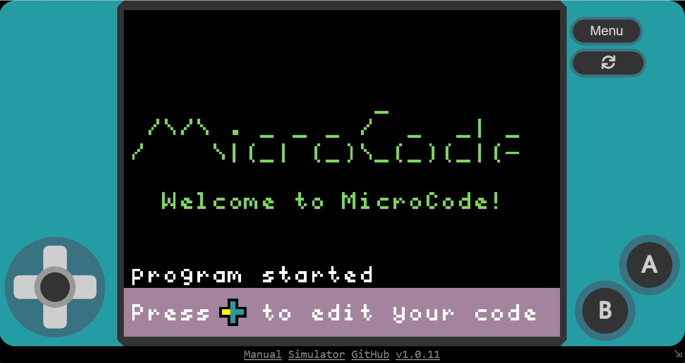
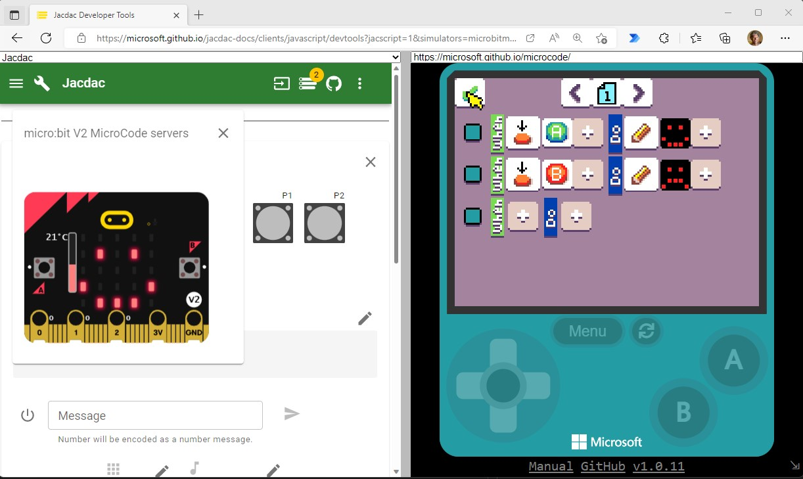

# MicroCode Manual

There are three ways to run MicroCode:

-   [web app](https://microsoft.github.io/microcode) with micro:bit simulator
-   web app and hex file deployed to micro:bit V2 device
-   hex file deployed to micro:bit V2 device and [Arcade Shield](https://www.kittenbot.cc/products/newbit-arcade-shield) (for editing program)

See below for more information about the MicroCode web app, micro:bit simulator, and how to deploy MicroCode to the micro:bit V2. Regardless of which way you run MicroCode, you will probably want to know a little bit about the MicroCode [icon-based language](./language.md).

## Web app

The easiest way to get started with MicroCode is through the [web app](https://microsoft.github.io/microcode), shown below. We recommend using the keyboard (rather than the virtual D-pad and buttons):

-   Arrow keys for D-pad
-   Space bar for A button
-   Enter for B button (ESC and backspace not yet mapped to B)

## Micro:bit simulator

From the web app, make sure that the web browser is not full screen and you will see four links at the bottom of the app (see image above):

-   **Manual** (this page)
-   **Simulator**
-   **GitHub** (this repo)
-   **Version #** (links to micro:bit hex file)

Clicking on the simulator link will open a page with the MicroCode web app on the right side and a micro:bit simulator and Jacdac dashboard on the left, as shown below. Your MicroCode program is saved, compiled and updated to the micro:bit (simulator or device) on every edit, so everything should be live and running all the time.

## Micro:bit V2 device and hex file

See the directions above about the four links at the bottom of the web app. Click on the version number (last of four links) to download the MicroCode hex file. Next, copy this file to your micro:bit V2 over USB (the micro:bit V1 is not supported).

This hex file has the complete MicroCode app, but also can receive MicroCode compiled programs you create in the web app (when connected via Web USB).

**TODO: how to download compiled MicroCode program to micro:bit**
