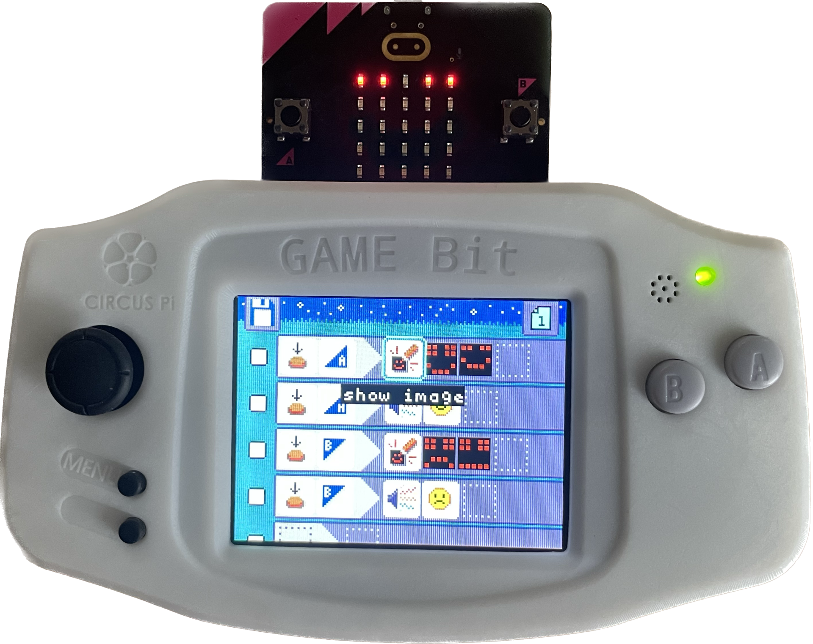

To run MicroCode, you need at least:

-   a micro:bit V2, available from many vendors [vendors](https://microbit.org/buy/)
-   a micro:bit [Arcade shield](#arcade-shields)

If you want to use Jacdac accessories, you will also need:

-   a Jacdac kit of Jacdac modules

If you further want to use MicroCode with a micro:bit robot, you will also need to purchase the robot, as well as a separate micro:bit for slotting into the robot.

## KittenBot MicroCode product

KittenBot recently introduced a [MicroCode Explorer Kit](https://www.kittenbot.cc/products/kittenbot-microcode-explorer-kit-computer-free-programming) that includes a micro:bit V2, newbit Arcade shield, Jacdac Kit A.

## Arcade Shields for the micro:bit V2

Three Arcade shields for the micro:bit V2 are available on the market today, as shown below. After downloading the MicroCode hex file to your micro:bit V2, whenever you plug the micro:bit into the Arcade Shield, MicroCode should start running. Your MicroCode program is always live and runnable. Once you remove the micro:bit from the shield, the program will persist and continue to run (assuming the micro:bit is still powered, of course).

<table>
<tr valign="top">
<td width="33%" >
<a href="https://www.kittenbot.cc/products/newbit-arcade-shield">
Kittenbot's newbit Arcade shield
</a>
</td><td width="33%" >
<a href="https://shop.elecfreaks.com/products/micro-bit-retro-programming-arcade">
ELECFREAK's micro:bit Arcade shield
</a>
</td>
<td width="33%" >
<a href="https://www.icshop.com.tw/products/368112100137?locale=en">
ICShopping's Game:bit Arcade shield
</a>
</td></tr>
<tr>
<td>

</td><td>

</td><td>

</td></tr>
<tr valign="top">
<td>

Small screen. No battery or battery pack included. 3.7V JST power jack on back. One <a href="https://aka.ms/jacdac">Jacdac</a> port.

</td>

<td>

Assembly required. Small screen. AAA Battery pack on back. One <a href="https://aka.ms/jacdac">Jacdac</a> port.

</td>
<td>

No assembly required. Large screen and 3d-printed enclosure with LiPo battery inside. Two <a href="https://aka.ms/jacdac">Jacdac</a> ports.

</td>
</tr>

</table>
