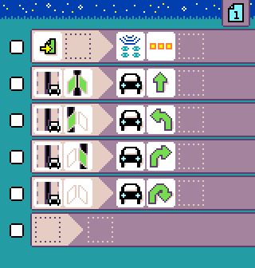

# Programming a micro:bit robot

{:class="sample"}

## The context

There are many [BBC micro:bit robot accessories](https://microbit.org/buy/accessories/?category=Robotics), which the micro:bit slots into to provide a "programmable robot brain". We have worked with a handful of these robots to develop a platform approach that will make it simpler for teachers and students to work with a wide variety of micro:bit robots. Our hope is that all micro:bit robots will eventually be supported by this platform.

The platform is based on a robust robot controller, written using MakeCode, that runs on the robot (micro:bit V1 or V2) and exposes a radio protocol to communicate with another micro:bit, running the user's program. The robot controller code is written using MakeCode for the micro:bit and has a common set of programming blocks.

## MicroCode programming

MicroCode provides a simplified programming experience for robots that are equipped with two motors, sonar and line sensors. The user's code can be updated very quickly using the Arcade shield.

{:class="sample"}

## Preparing the robot micro:bit

You will need one of the **[supported micro:bit robots](./robots-supported.md)** and an extra micro:bit (v1 or v2) to run on the robot.

### Configuring the radio group

The microcode editor and the robot micro:bit communicate using the radio. These are the steps to configure the robot and the microcode:

On the robot micro:bit,

-   Reset the robot micro:bit and note the radio group,
-   If you need to change the group number, press button `A+B` to enter the configuration mode until your see `RADIO ...` message.
-   Press `A` or `B` to increase or decrease the radio group.

The radio group is stored in the flash of the micro:bit and will be used every time the robot is reset. (However, it will be erased if you download another .hex file).

On the microcode side,

-   Use the {:class="icon"} `radio set group` to configure the same group number as the robot micro:bit

{:class="rule"}

### Calibrating motor drift

It is not uncommon for 2 wheeled robot to slightly drift towards one side. To correct this behavior, you can configure a drift parameter on the robot.

On the robot micro:bit,

-   Press ` A+B` to switch to configuration mode, until you see the `DRIFT ...` message.
-   Let the robot go forward until it goes as straight as possible by pressing A and B to increase or modify the drift.

The drift value will be stored in the flash of the micro:bit and will be used every time the robot is reset.
(However it will be erased if you download another .hex file, so you might want to write it down somewhere).

## Tiles

The tiles are documented
in the [language robot section](./language#robot).

## Samples

The samples are listed on the [samples page](./samples.md#robot).

## Troubleshooting

This is a quick check list to make sure you have the best experience with the microcode robot:

-   **Charge your batteries** - everything starts to fall apart once the battery level gets low! Keep those batteries topped off!
-   **Double check the radio groups** - make sure the microcode program and the robot are on the same radio group

## Add your robot {#contribute}

The source of the robot firmware are at [https://github.com/microsoft/microcode/tree/main/robot](https://github.com/microsoft/microcode/tree/main/robot). We accept pull request to add new robots.

### Hardware requirements

The firmware is designed for popular rover robots found in the micro:bit ecosystem
(and more can be added):

-   2 motors that can be forward, backward, left, right turns. Precise detection of distance is **not** needed.
-   a line sensor that can detect black and white lines
-   a distance sensor, typically an ultrasonic sensor

The following features are found often but are optional:

-   RGB LEDs
-   Buzzer
-   Programmable LED strip
