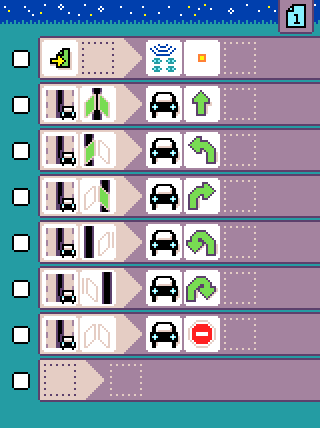

# Robot

MicroCode supports programming a separate micro:bit robot equipped with two motors,
sonar and line sensors.

{:class="sample"}

## Preparing the robot micro:bit

You will need one of the [supported micro:bit robots](./robots-supported.md) and an extra micro:bit (v1 or v2) to run on the robot.

## Configuring the radio group

The microcode editor and the robot micro:bit communicate using the radio. These are the steps to configure the robot and the microcode:

On the robot micro:bit,

-   Reset the robot micro:bit and note the radio group. The group is based on the serial number of the micro:bit and will remain the same; (unfortunately it might also conflict with another micro:bit)
-   If you need to change the group number, press button A or B to select another radio group. You will have to do this every time you reset the robot micro:bit

On the microcode side,

-   Use the {:class="icon"} `radio set group` to configure the same group number as the robot micro:bit

{:class="rule"}

## Calibrating motor drift

It is not uncommon for 2 wheeled robot to slightly drift towards one side. To correct this behavior, you can configure a drift parameter on the robot.

On the robot micro:bit,

-   Press A+B to switch to the `DRIFT` configuration mode.
-   Let the robot go forward until it goes as straight as possible by pressing A and B to increase or modify the drift.
-   Once you have found the perfect drift value, make sure to write it down.

You can also create new .hex file that contains the adjusted drift:

-   open the [MakeCode for micro:bit editor](https://makecode.microbit.org/)
-   create a new project
-   add the **microcode robot extension** at https://github.com/microsoft/microcode/robot .
-   in `on start`, drag the bloc to select your robot type
-   drag the block to configure the drift value, voila!
-   drag the block to configure the radio group

## Tiles

The tiles are documented
in the [language robot section](./language#robot).

## Samples

The samples are listed on the [samples page](./samples.md#robot).

## Troubleshooting

This is a quick check list to make sure you have the best experience with the microcode robot:

-   **Charge your batteries** - everything starts to fall apart once the battery level gets low! Keep those batteries topped off!
-   **Double check the radio groups** - make sure the microcode program and the robot are on the same radio group

## Add your robot {#contribute}

The source of the robot firmware are at [https://github.com/microsoft/microcode/tree/main/robot](https://github.com/microsoft/microcode/tree/main/robot). We accept pull request to add new robots.

### Hardware requirements

The firmware is designed for popular rover robots found in the micro:bit ecosystem
(and more can be added):

-   2 motors that can be forward, backward, left, right turns. Precise detection of distance is **not** needed.
-   a line sensor that can detect black and white lines
-   a distance sensor, typically an ultrasonic sensor

The following features are found often but are optional:

-   RGB LEDs
-   Buzzer
-   Programmable LED strip

### Contributing

To add a new robot to the list, prepare a pull request with:

-   a new class extending `Robot` and configuring the hardware (see other robots)
-   a global field instance instantiating the robot (see other robots)
-   a URL in the jsdocs of the class pointing to the robot homepage
-   add `main{company}{productname}.ts` file that starts the robot
-   add `pxt-{company}{productname}.ts` file that overrides the test files to load `main{company}{productname}.ts`
-   add image under `docs/static/images`

Make sure to test and tune the configuration options in the robot class for your particular
chassis/motor/line detectors. You may want to tweak some of the constants in the robot class to optimize the behavior of the robot.
