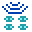

# Robot

Microcode supports programming a separate micro:bit robot.

## Preparing the robot micro:bit

You will need one of the following micro:bit robot and an extra micro:bit (v1 or v2) to run on the robot. (Contact us if your robot is not listed)

### Hardware requirements

The firmware is designed for popular rover robots found in the micro:bit ecosystem
(and more can be added):

-   2 motors that can be forward, backward, left, right turns. Precise detection of distance is **not** needed.
-   a line sensor that can detect black and white lines
-   a distance sensor, typically an ultrasonic sensor

The following features are found often but are optional:

-   RGB LEDs
-   Buzzer
-   Programmable LED strip

### Elecfreaks Cutebot

-   Download [robot-cutebox.hex](https://microsoft.github.io/microcode/assets/robot-cutebox.hex) to micro:bit attached to the Cutebot

### Yahboom Tiny:bit

[

-   Download [robot-tinybit.hex](https://microsoft.github.io/microcode/assets/robot-tinybit.hex)

## Configuring the radio group

The microcode editor and the robot micro:bit communiate using the radio. These are the steps to configure the robot and the microcode:

On the robot micro:bit,

-   Reset the robot micro:bit and note the radio group. The group is based on the serial number of the micro:bit and will remain the same; (unfortunately it might also conflict with another micro:bit)
-   If you need to change the group number, press button A or B to select another radio group. You will have to do this every time you reset the robot micro:bit

On the microcode side,

-   Use the {:class="icon"} `radio set group` to configure the same group number as the robot micro:bit

{:class="rule"}

## Calibrating motor drift

It is not uncommon for 2 wheeled robot to slightly drift towards one side. To correct this behavior, you can configure a drift parameter on the robot.

On the microcode side,

-   Create a program that orders the robot to go forward

On the robot micro:bit,

-   Press A+B to switch to the `DRIFT` configuration mode.
-   Press A and B to increase or decrease the drift. A positive drift adjustment will steer the robot to the right.
-   Let the robot go forward until it goes as straight as possible

Write down the drift parameter as you will have to configure it every time you reset the robot micro:bit.

## Tiles

The tiles are documented
in the [language robot section](./language#robot).

## Troubleshooting

This is a quick check list to make sure you have the best experience with the microcode robot:

-   **Charge your batteries** - everything starts to fall apart once the battery level gets low! Keep those batteries topped off!
-   **Double check the radio groups** - make sure the microcode program and the robot are on the same radio group

## Add your robot

The source of the robot firmware are at https://github.com/microsoft/microcode/tree/main/robot. We accept pull request to add new robots.
