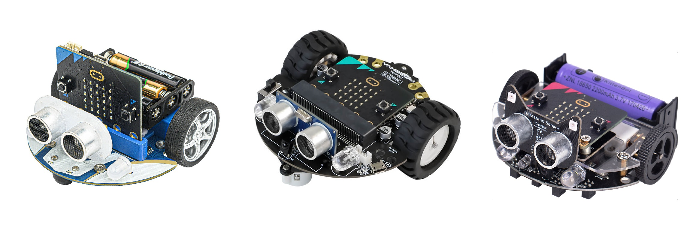
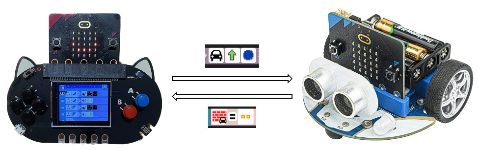
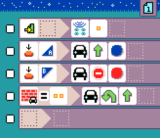

# Robot

{:class="photo"}

There are many [BBC micro:bit robot accessories](https://microbit.org/buy/accessories/?category=Robotics), which the micro:bit slots into to provide a "programmable robot brain". We have worked with a [handful of these robots](./robots-supported.md) to develop a platform approach that will make it simpler for teachers and students to work with a wide variety of micro:bit robots. Our hope is that all micro:bit robots will eventually be supported by this platform.

The platform is based on a robust robot controller, written using MakeCode, that runs on the robot (micro:bit V1 or V2) and exposes a radio protocol to communicate with another micro:bit, running the user's program. The robot controller code is written using MakeCode for the micro:bit and has a common set of programming blocks.

{:class="photo"}

## Robot features

-   **Two motors** - the robot controller can drive two motors independently, allowing the robot to move forward, backward, turn left and right. Microcode provides a calibration feature to compensate for motor drift, and smooth acceleration and deceleration.
-   **Line sensors** - the robot controller can read the state of two line sensors, allowing the robot to follow a line. Microcode provides enhanced line following features, including tracking transition to help with line following algorithms.
-   **Sonar** - the robot controller can read the distance from a sonar sensor, allowing the robot to avoid obstacles. The library has a builtin filtering feature to reduce sensor noise.
-   **Radio** - the robot controller can communicate with another micro:bit using the radio, allowing the user's program to control the robot.
-   **Universal MakeCode blocks** for all robots: the robot controller exposes a common set of programming blocks, allowing the user's program to work with any robot that supports the platform.
-   Supports micro:bit V1: Recycle your micro:bit as robot controllers!

## MicroCode programming

MicroCode provides a simplified programming experience for robots that are equipped with two motors, sonar and line sensors. The user's code can be updated very quickly using the Arcade shield.

{:class="sample"}

## Preparing the robot micro:bit

You will need one of the **[supported micro:bit robots](./robots-supported.md)** and an extra micro:bit (v1 or v2) to run on the robot.

### Configuring the radio group

The MicroCode editor and the robot micro:bit communicate using the radio. These are the steps to configure the robot and the MicroCode:

On the robot micro:bit,

-   Reset the robot micro:bit and note the radio group,
-   If you need to change the group number, press button `A+B` to enter the configuration mode until your see `RADIO ...` message.
-   Press `A` or `B` to increase or decrease the radio group.

The radio group is stored in the flash of the micro:bit and will be used every time the robot is reset. (However, it will be erased if you download another .hex file).

On the MicroCode side,

-   Use the {:class="icon"} `radio set group` to configure the same group number as the robot micro:bit

{:class="rule"}

### Calibrating motor drift

It is not uncommon for 2 wheeled robot to slightly drift towards one side. To correct this behavior, you can configure a drift parameter on the robot.

On the robot micro:bit,

-   Press `A+B` to switch to configuration mode, until you see the `DRIFT ...` message.
-   Let the robot go forward until it goes as straight as possible by pressing A and B to increase or modify the drift.

{:class="sample"}

The robot drift tester program above lets you test the drift for medium and high speeds. Clap or shoot to stop the robot.

The drift value will be stored in the flash of the micro:bit and will be used every time the robot is reset.
(However it will be erased if you download another .hex file, so you might want to write it down somewhere).

### Calibrating the maximum line speed

In line assist mode, the robot will automatically lower the speed when it detects a line. You can configure the maximum speed for the robot to use when it is on a line. This is useful when you add weight to the robot and it needs more power
to move around.

-   Press `A+B` to switch to configuration mode, until you see the `LINE SPEED ...` message.
-   Press `A` and `B` to change the speed and test it with your robot.

## Tiles

The tiles are documented
in the [language robot section](./language#robot).

## Samples

The samples are listed on the [samples page](./samples.md#robot).

## Troubleshooting

This is a quick check list to make sure you have the best experience with the MicroCode robot:

-   **Charge your batteries** - everything starts to fall apart once the battery level gets low! Keep those batteries topped off!
-   **Double check the radio groups** - make sure the MicroCode program and the robot are on the same radio group

## Add your robot {#contribute}

We accept pull requests to add new robots. See the [contributing](./robots-supported.md) page for more details.
