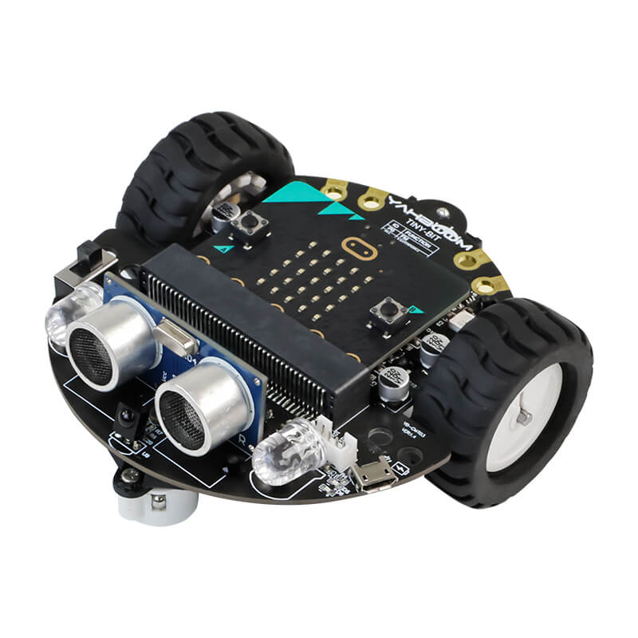

## Supported robots

MicroCode supports the following [robots](./robot.md):

-   [DFRobot Maqueen](#dfrobot-maq)
-   [DFRobot Maqueen Plus](#dfrobot-maq-plus)
-   [Elecfreaks Cutebot](#cutebot)
-   [Elecfreaks Cutebot PRO](#cutebot-pro)
-   [InkSmith K8](#inksmith-k8)
-   [KeyStudio KS0426 Mini Smart Robot](#keystudio-mini)
-   [KittenBot MiniLFR](#kittenbot-mlfr)
-   [KittenBot Robotbit](#kittenbot-robotbit)
-   [KittenBot Nanobit](#kittenbot-nanobit)
-   [Yahboom Tiny:bit](#yahboom)

Please file a [GitHub issue](https://github.com/microsoft/microcode/issues?q=is%3Aissue+is%3Aopen+label%3Arobot) if your robot is not listed.
See [how to contribute](#contributing) for more information.

### DFRobot Maqueen V2+ {#dfrobot-maq}

{:class="photo"}

-   [Home](https://wiki.dfrobot.com/micro_Maqueen_for_micro_bit_SKU_ROB0148-EN)
-   [Download for micro:bit V1](https://microsoft.github.io/microbit-robot/assets/dfrobot-maqueen-for-microbit-v1.hex)
-   [Download for micro:bit V2](https://microsoft.github.io/microbit-robot/assets/dfrobot-maqueen-for-microbit-v2.hex)

### DFRobot Maqueen Plus V2 {#dfrobot-maq-plus}

{:class="photo"}

-   [Home](https://www.dfrobot.com/product-2026.html)
-   [Download for micro:bit V1](https://microsoft.github.io/microbit-robot/assets/dfrobot-maqueen-plus-for-microbit-v1.hex)
-   [Download for micro:bit V2](https://microsoft.github.io/microbit-robot/assets/dfrobot-maqueen-plus-for-microbit-v2.hex)

### Elecfreaks Cutebot {#cutebot}

{:class="photo"}

-   [Home](https://www.elecfreaks.com/micro-bit-smart-cutebot.html)
-   [Download for micro:bit V1](https://microsoft.github.io/microbit-robot/assets/elecfreaks-cutebot-for-microbit-v1.hex)
-   [Download for micro:bit V2](https://microsoft.github.io/microbit-robot/assets/elecfreaks-cutebot-for-microbit-v2.hex)

### Elecfreaks Cutebot PRO {#cutebot-pro}

{:class="photo"}

-   [Home](https://shop.elecfreaks.com/products/elecfreaks-smart-cutebot-pro-v2-programming-robot-car-for-micro-bit)
-   [Download for micro:bit V1](https://microsoft.github.io/microbit-robot/assets/elecfreaks-cutebotpro-for-microbit-v1.hex)
-   [Download for micro:bit V2](https://microsoft.github.io/microbit-robot/assets/elecfreaks-cutebotpro-for-microbit-v2.hex)

## InkSmith K8 {#inksmith-k8}

{:class="photo"}

-   [Home](https://www.inksmith.ca/products/k8-robotics-kit)
-   [Download for micro:bit V1](https://microsoft.github.io/microbit-robot/assets/inksmith-k8-for-microbit-v1.hex)
-   [Download for micro:bit V2](https://microsoft.github.io/microbit-robot/assets/inksmith-k8-for-microbit-v2.hex)

### KeyStudio KS0426 Mini Smart Robot {#keystudio-mini}

-   [Home](https://wiki.keyestudio.com/KS0426_Keyestudio_Micro%EF%BC%9Abit_Mini_Smart_Robot_Car_Kit_V2)
-   [Download for micro:bit V1](https://microsoft.github.io/microbit-robot/assets/keystudio-minismartrobot-for-microbit-v1.hex)
-   [Download for micro:bit V2](https://microsoft.github.io/microbit-robot/assets/keystudio-minismartrobot-for-microbit-v2.hex)

### KittenBot MiniLFR {#kittenbot-mlfr}

{:class="photo"}

-   [Home](https://www.kittenbot.cc/products/kittenbot-minilfr-programmable-robot-car-kit-for-microbit)
-   [Download for micro:bit V1](https://microsoft.github.io/microbit-robot/assets/kittenbot-minilfr-for-microbit-v1.hex)
-   [Download for micro:bit V2](https://microsoft.github.io/microbit-robot/assets/kittenbot-minilfr-for-microbit-v2.hex)

### KittenBot Robotbit {#kittenbot-robotbit}

{:class="photo"}

-   [Home](https://www.kittenbot.cc/products/robotbit-robotics-expansion-board-for-micro-bit)
-   [Download for micro:bit V1](https://microsoft.github.io/microbit-robot/assets/kittenbot-robotbit-for-microbit-v1.hex)
-   [Download for micro:bit V2](https://microsoft.github.io/microbit-robot/assets/kittenbot-robotbit-for-microbit-v2.hex)

### KittenBot Nanobit {#kittenbot-nanobit}

{:class="photo"}

-   [Home](https://www.kittenbot.cc/products/kittenbot-nanobit-with-kb-link-downloader-for-makecode-python-and-arduino-programming)
-   [Download for micro:bit V1](https://microsoft.github.io/microbit-robot/assets/kittenbot-nanobit-for-microbit-v1.hex)
-   [Download for micro:bit V2](https://microsoft.github.io/microbit-robot/assets/kittenbot-nanobit-for-microbit-v2.hex)

### Yahboom Tiny:bit {#yahboom}

{:class="photo"}

-   [Home](http://www.yahboom.net/study/Tiny:bit)
-   [Download for micro:bit V1](https://microsoft.github.io/microbit-robot/assets/yahboom-tinybit-for-microbit-v1.hex)
-   [Download for micro:bit V2](https://microsoft.github.io/microbit-robot/assets/yahboom-tinybit-for-microbit-v2.hex)

### Contributing {#contributing}

The source of the robot firmware are at [https://github.com/microsoft/microcode/tree/main/robot](https://github.com/microsoft/microcode/tree/main/robot). We accept pull request to add new robots.

### Hardware requirements

The firmware is designed for popular rover robots found in the micro:bit ecosystem
(and more can be added):

-   2 motors that can be forward, backward, left, right turns. Precise detection of distance is **not** needed.
-   2 or more line sensors
-   a distance sensor, typically an ultrasonic sensor

The following features are found often but are optional:

-   RGB LEDs
-   Buzzer
-   Programmable LED strip

### How to prepare a pull request {#new-robot}

To add a new robot to the list, prepare a pull request in [microsoft/microcode](https://github.com/microsoft/microcode) with:

-   a new class extending `Robot` and configuring the hardware (see other robots)
-   a global field instance instantiating the robot (see other robots)
-   a URL in the jsdocs of the class pointing to the robot homepage
-   add `main{company}{productname}.ts` file that starts the robot
-   add `pxt-{company}{productname}.json` file that overrides the test files to load `main{company}{productname}.ts`
-   add call to `mkc pxt-{company}{productname}.json` in `.github/workflows/makecode.yml`
-   add image under `docs/static/images`
-   add section in `docs/robot-supported.md` with your robot picture, and Home URL.

Make sure to test and tune the configuration options in the robot class for your particular
chassis/motor/line detectors. You may want to tweak some of the constants in the robot class to optimize the behavior of the robot.
