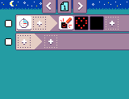
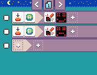
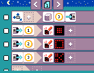
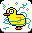

# Samples

These are some of the annotated MicroCode
samples.

##  Flashing Heart

The goal of this program is to show a cute heart animation.

We use a single rule with a timer. The timer starts a screen animation
with two images. Since this happens in a loop, it creates a cool heart animation.

##  Flashing Heart

The goal of this program is to show a smiley
when pressing A, and a frowney when
pressing B.

We use 2 rule to handle each buttons. The first rule
handle a button A pressed and prints a smiley the screen. Similarly, the second rule filters on button B
and prints a frowney.

##  Rock Paper Scissors

The classic game of rock paper scissors
where the micro:bit display a different
symbol when shaken.

The program starts with a rule that uses
the accelerometer sensor; which by default 
detects shake events. The 3-face dice is cast
and the result is piped in pipe A.

The next 3 rules match the value passed in pipe A
and display a different symbol for each value, 1, 2 or 3.

##  Chuck a duck

This is a radio program so you'll need 2 micro:bits running to get it to work.

The program "sends" a duck using the radio
by pressing A.

In code, the accelerometer sensor is used
in two rules to clear the screen (duck is gone)
and send a number using the radio.

The third rule uses the radio filter to render
the duck on the screen. This rule executes
when a radio message is received.

Try it out, it's lots of fun!