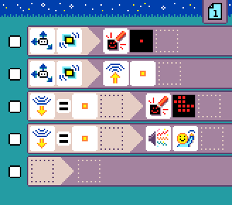

# Samples

These are some of the annotated MicroCode
samples.

## {:class="icon-sample"} Flashing Heart

{:class="sample"}

The goal of this program is to show a cute heart animation.

We use a single rule with a timer. The timer starts a screen animation
with two images. Since this happens in a loop, it creates a cool heart animation.

### improvement ideas

* add more animation frames to create a better beating heart

## {:class="icon-sample"} Smiley Buttons

{:class="sample"}

The goal of this program is to show a smiley
when pressing A, and a frowney when
pressing B.

We use 2 rule to handle each buttons. The first rule
handle a button A pressed and prints a smiley the screen. Similarly, the second rule filters on button B
and prints a frowney.

### improvement ideas

* add sound emoji for each buttons to make it more lively

## {:class="icon-sample"} Rock Paper Scissors

{:class="sample"}

The classic game of rock paper scissors
where the micro:bit display a different
symbol when shaken.

The program starts with a rule that uses
the accelerometer sensor; which by default 
detects shake events. The 3-face dice is cast
and the result is stored in variable A.

The next 3 rules match the value passed in variable A
and display a different symbol for each value, 1, 2 or 3.

### improvement ideas

* add sound emoji whenever shake happens
* clear the screen before showing the new symbol

## {:class="icon-sample"} Chuck a duck

{:class="sample"}

This is a radio program so you'll need 2 micro:bits running to get it to work.

The program "sends" a duck using the radio
by pressing A.

In code, the accelerometer sensor is used
in two rules to clear the screen (duck is gone)
and send a number using the radio.

The third rule uses the radio filter to render
the duck on the screen. This rule executes
when a radio message is received.

### improvement ideas

* add sound emoji when the duck arrives
* use different radio messages for different images

## {:class="icon-sample"} Hot potato

{:class="sample"}

Pass the hot potato around and make
sure it does not beep while you have it 
in your hands!

### improvement ideas

* add sound emoji when timer expires
* add a better expired potato animation

## {:class="icon-sample"} Pet Hamster

{:class="sample"}

Keep your micro:pet happy by petting
its head (Logo) and don't shake it, it does not like that.

### improvement ideas

* use more rules to manipulate the mood of your pet

## {:class="icon-sample"} Clap Lights

{:class="sample"}

Allows to turn on and off the LEDs of the screen. When a loud sound is detected
switch between page 1 and page 2 where the page start by turning on or off the LEDs.

### improvement ideas

* add sounds to notify your user that the command was received