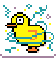
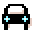

Annotated example programs.

{:class="sample"}

-   [{:class="icon"} first program](./samples/first-program)

## The basics

-   [{:class="icon"} flashing heart](./samples/flashing-heart)
-   [{:class="icon"} smiley buttons](./samples/smiley-buttons)
-   [{:class="icon"} pet hamster](./samples/pet-hamster)

## Variables

These sample use variables to store and read numeric values.

### Dices

These samples store a random number and use to build mini games.

-   [{:class="icon"} head or tail](./samples/head-or-tail)
-   [crooked head or tail](./samples/crooked-head-or-tail)

-   [{:class="icon"} rock paper scissors](./samples/rock-paper-scissors)

### Counters

These sample use variables to build counters using buttons, movement or sounds:

-   [counter](./samples/counter)
-   [step counter](./samples/step-counter)
-   [clap counter](./samples/clap-counter)
-   [random counter](./samples/random-counter)

These counters are a bit more involved:

-   [times table](./samples/times-table)

## Pages

These sample use multiple pages in their programs:

-   [{:class="icon"} hot potato](./samples/hot-potato)
-   [{:class="icon"} clap lights](./samples/clap-lights)
-   [{:class="icon"} reaction time](./samples/reaction-time)
-   [double counter](./samples/double-counter)
-   [battery charger prank](./samples/battery-charger-prank)
-   [24 7 clap game](./samples/24-7-clap)

## Radio

These programs use radio to send messages between multiple
micro:bits.

-   [{:class="icon"} chuck a duck](./samples/chuck-a-duck)
-   [{:class="icon"} firefly](./samples/firefly)
-   [zombie detector](./samples/zombie-detector)
-   [green light red light](./samples/green-light-red-light)

## micro:bit Robot {#robot}

These sample work with a [2 wheel robot controlled by a micro:bit](./robot).

-   [{:class="icon"}robot shake](./samples/robot-shake)
-   [{:class="icon"} robot avoid wall](./samples/robot-avoid-wall)
-   [{:class="icon"} robot follow line](./samples/robot-follow-line)

## Jacdac modules {#jacdac}

These samples use [Jacdac](https://aka.ms/jacdac) modules to extend the capabilities of the
micro:bit. The programming tiles for the modules appear in MicroCode when the modules are
plugged in (either via a Jacdaptor or the Kittenbot shield). All the modules from [Kittenbot Jacdac Kit A](https://microsoft.github.io/jacdac-docs/devices/kittenbot/jacdacstarterkitawithjacdaptorformicrobitv2v10/) and the [Forward Education Climate Kit](https://microsoft.github.io/jacdac-docs/devices/forward-education/climateactionkitv10/) are supported.

-   [{:class="icon"} railroad crossing](./samples/railroad-crossing)
-   [inchworm robot](./samples/inchworm)
-   [{:class="icon"} measure light](./samples/light-levels)
-   [{:class="icon"} detect magnet](./samples/magnet-levels)
-   [{:class="icon"} slider](./samples/slider-levels)
-   [{:class="icon"} turn dial](./samples/count-turns)
-   [{:class="icon"} key demo](./samples/key-demo)
-   [{:class="icon"} water plant](./samples/water-plant)
-   [{:class="icon"} measure distance](./samples/distance-measure)
