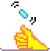

# Samples

-   [{:class="icon"} first program](./samples/first-program)

## The basics

-   [{:class="icon"} flashing heart](./samples/flashing-heart)
-   [{:class="icon"} simley buttons](./samples/smiley-buttons)
-   [{:class="icon"} pet hamster](./samples/pet-hamster)

## Variables

These sample use variables to store and read numeric values.

- [{:class="icon"} head or tail](.samples/head-or-tail)
-   [{:class="icon"} rock paper scissors](./samples/rock-paper-scissors)
-   [counter](./samples/counter)

## Pages

These sample use multiple pages in their programs.

-   [{:class="icon"} hot potato](./samples/hot-potato)
-   [{:class="icon"} clap lights](./samples/clap-lights)
-   [{:class="icon"} reaction time](./samples/reaction-time)

## Radio

These programs use radio to send messages between multiple
micro:bits.

-   [{:class="icon"} chuck a duck](./samples/chuck-a-duck)
-   [{:class="icon"} firefly](./samples/firefly)

## Accessories

These sample use [Jacdac](https://aka.ms/jacdac) module
to extend the micro:bit with LEDs, servos and other accessories.

-   [{:class="icon"} railroad crossing](./samples/railroad-crossing)
