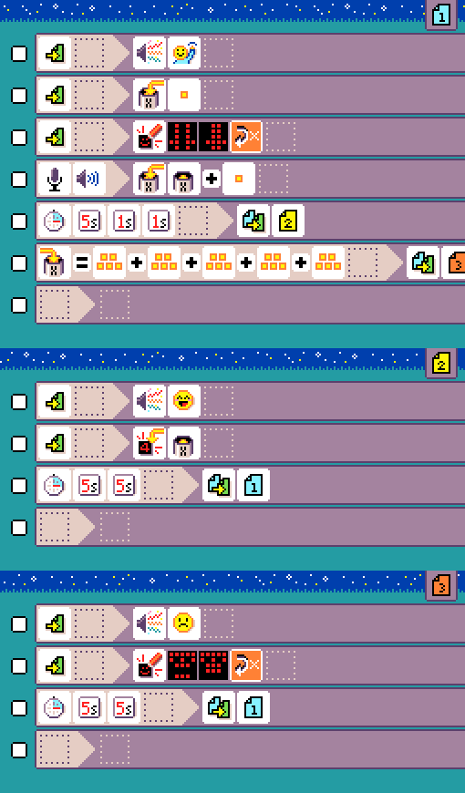
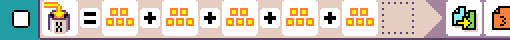
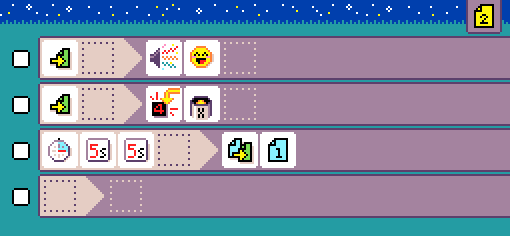
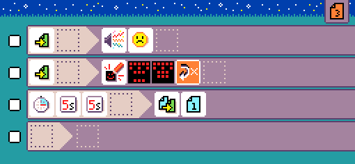

{:class="sample"}

Clap as many times as you can in 7 seconds, but no more than 24 times... that's the game and it will make you crazy.

-   [Open in MicroCode](/microcode/#H4sIAKCjLGUAAxXLWwqDMBBG4U21pS99mKYWK1IdghE3YBiJ/OMFI1m9+ng4fEUvtvZQZcQxYkE26czGD5+8pvJnXTLrGO+t+zLC/rdNKGwj0hFDEZFmPp9Ie7Vevnw+bmT8lpCfvnKhQ/DZm5heB1rtfyFsAAAA)

The game has 3 pages: page 1 is for clapping, page 2 is victory and score, page 3 is game over.

## {:class="icon"} page 1

{:class="sample"}

### Setup

The first 3 rules setup the game environment.

-   play a sound to tell the user clapping started

{:class="rule"}

-   set variable `X` to 1, variable `X` will hold the clap count

{:class="rule"}

-   start a clap animation on the screen

{:class="rule"}

### Clapping

The 4th rule increments the variable `X` when a clap is detected.

{:class="rule"}

### Transitions

The last two rules handle transitioning to winning or loosing state.

-   after 7 seconds, switch to page 2 and show score

{:class="rule"}

-   when the counter hits 25, the player clapped too many time and switch to page 3 for game over

{:class="rule"}

## {:class="icon"} page 2

{:class="sample"}

The 7 second expired and the player clapped 24 or less times,
show score and switch back to page 1 after 10 seconds.

## {:class="icon"} page 3

{:class="sample"}

The player clapped too many times, show game over animation and switch back to page 1.
