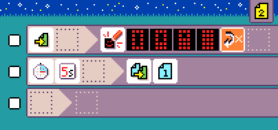

# {:class="icon-sample"} Battery charger prank

{:class="sample"}

Tell your friend to keep shaking the micro:bit to
recharge the battery... Silly prank.

-  [Open in MicroCode](/microcode/#H4sIAKOMR2MAA41RXU+DMBT9SyBGw4MPiIi3rpjZsiFvU5wpsM3Ilrb8em9bzKyJzoebk96e5nz0VRP5som3db7YQPt+CX0iHvo9IkxIEQdRjpmomBRzBhdLTa4LRppZSgp88wxdoAr2JinPFL1JcDJphydm3I5n8p7B8C8unieuppo0a6a++aCeD+p85M7HkyrCeFzltx+1709DH8azu31cVcGAmZnZI3J731MFfYB6mdWY89JqcKdRUF7u0BNm8D0efeNd2gmj9wd32p3gYk+nuVN3v3Fb7Mjl/MoX+PncXz4Kmy+nvPPzYnem8/XCdIadG170o7soPHJSclZXZFwt4wO0O9G0cKD6PIJtcPUJ1yEjm2ACAAA=)

## {:class="icon"} page 1

{:class="sample"}

Page 1 shows a "battery low" animation
and waits for a `shake` event to switch to page 2.

## {:class="icon"} page 2

{:class="sample"}

Page 2 shows a "battery chargin" animation
and switches back to page 1 after 5 seconds.

Since the user is supposed to keep shaking
the micro:bit, it will keep returning to page 2.
