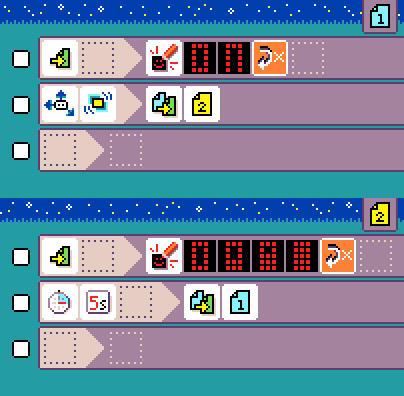

# {:class="icon-sample"} Battery charger prank

{:class="sample"}

Tell your friend to keep shaking the micro:bit to
recharge the battery... Silly prank.

## {:class="icon"} page 1

{:class="sample"}

Page 1 shows a "battery low" animation
and waits for a `shake` event to switch to page 2.

## {:class="icon"} page 2

{:class="sample"}

Page 2 shows a "battery chargin" animation
and switches back to page 1 after 5 seconds.

Since the user is supposed to keep shaking
the micro:bit, it will keep returning to page 2.
