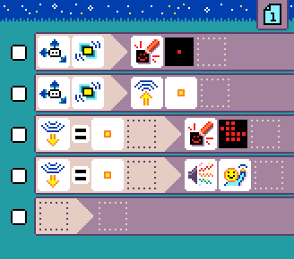
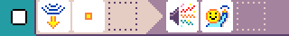
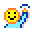
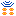

# {:class="icon-sample"} Chuck a duck {#chuck-a-duck}

{:class="sample"}

This is a radio program so you'll need 2 micro:bits running to get it to work. The program "sends" a duck using the radio
by shacking the micro:bit.

In code, the accelerometer sensor is used
in two rules to clear the screen (duck is gone)
and send a number using the radio.

{:class="rule"}

-   **when** {:class="icon"} {:class="icon"} shake, **do** {:class="icon"} clear screen.

{:class="rule"}

-   **when** {:class="icon"} {:class="icon"} shake, **do** {:class="icon"} radio send {:class="icon"} 1.

The third rule uses the radio filter to render
the duck on the screen. This rule executes
when a radio message is received.

{:class="rule"}

-   **when** {:class="icon"} radio receive {:class="icon"} 1, **do** {:class="icon"} paint duck on screen.

{:class="rule"}

-   **when** {:class="icon"} radio receive {:class="icon"} 1, **do** {:class="icon"} play sound emoji {:class="icon"} hello.

## Avoiding clashes with groups

If you try this activity with many micro:bits in the same room, they will all start
to trigger the activity. You can avoid groups interference by

-   have student use a different radio value than {:class="icon"} 1
-   add a rule that runs on the start of the page and sets a different radio group (default is 1)
    using {:class="icon"} `radio set group`.
    The message only reach other micro:bit in the same group.

## improvement ideas

-   add sound emoji when the duck arrives
-   use different radio messages for different images
