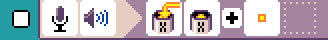
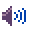

{:class="sample"}

This program counts how many times you clap using the microphone.

-   [Open in MicroCode](/microcode/#H4sIAKCjLGUAA/NKywwOyPCK8PU2SnKt8i9xDHR1AmJHAO6A3EEYAAAA)

{:class="rule"}

-   **when** {:class="icon"} microphone detects {:class="icon"} loud sound, **do** {:class="icon"} set variable `X` to {:class="icon"} variable `X` plus {:class="icon"} `value 1`

{:class="rule"}

-   **when** {:class="icon"} variable X changed, **do** show variable `X` value.
