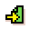
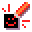

# {:class="icon-sample"} Clap Lights {#clap-lights}

{:class="sample"}

Allows to turn on and off the LEDs of the screen.

## {:class="icon"} page 1

{:class="sample"}

When the page starts, turn on all LEDs.
When a loud sound is detected switch between to page 2

{:class="rule"}

-   **when** {:class="icon"} page start, **do** {:class="icon"} paint screen with all leds.

{:class="rule"}

-   **when** {:class="icon"} microphone detects {:class="icon"} loud sound, **do** {:class="icon"} switch page to  page 2.

## {:class="icon"} page 2

{:class="sample"}

Similar to page 1 but in this case, we turn off all the LEDs.

{:class="rule"}

-   **when** {:class="icon"} page start, **do** {:class="icon"} turn off all LEDs

{:class="rule"}

-   **when** {:class="icon"} microphone detects {:class="icon"} loud sound, **do** {:class="icon"} switch page to  page 1.

## improvement ideas

-   add sounds to notify your user that the command was received
