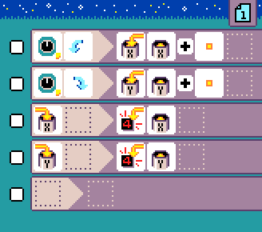

{:class="sample"}

This program requires a [Jacdac dial (rotary encoder) module](https://microsoft.github.io/jacdac-docs/devices/kittenbot/rotarybuttonv10/).
The dial tile raises two events: turn left and turn right.

The program counts the number of times the dial was turned left (in the variable `X`) and the number of times the dial was turned right (in the variable `Y`), displaying the count for each turn.

-   [Open in MicroCode](/microcode/#eyJwcm9nZGVmIjp7IlAiOlt7IlIiOlt7IlMiOlsiUzEyIl0sIkEiOlsiQTlBIl0sIkYiOlsiRjIxTCJdLCJNIjpbIk0yMEEiLCJNNiJdfSx7IlMiOlsiUzEyIl0sIkEiOlsiQTlCIl0sIkYiOlsiRjIxUiJdLCJNIjpbIk0yMEIiLCJNNiJdfSx7IlMiOlsiUzlBIl0sIkEiOlsiQTEwIl0sIk0iOlsiTTIwQSJdfSx7IlMiOlsiUzlCIl0sIkEiOlsiQTEwIl0sIk0iOlsiTTIwQiJdfSx7fV19LHsiUiI6W3t9XX0seyJSIjpbe31dfSx7IlIiOlt7fV19LHt9XX0sInZlcnNpb24iOiJ2Mi40LjI4In0)
