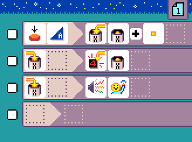
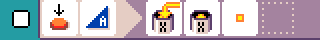
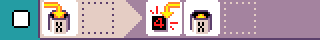

# Counter

{:class="sample"}

This program counts how many times you press `button A`.

{:class="rule"}

-   **when** {:class="icon"} press {:class="icon"} button A, **do** {:class="icon"} set variable `X` to {:class="icon"} variable `X` plus  {:class="icon"} `value 1`

{:class="rule"}

-   **when** {:class="icon"} variable X changed, **do** show variable `X` value.

## Video

<video class="sample" src="../videos/counter.mp4" controls="true"></video>
