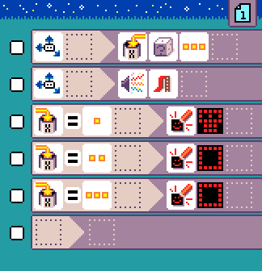
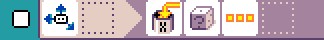
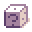
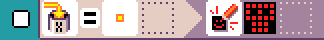
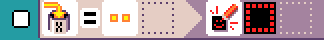
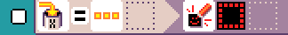

{:class="sample"}

-   [Open in MicroCode](/microcode/#H4sIAFu4UmMAA5WRzWrDMBCEX0lO3BYfenATkUqxJFopiZtb81fWVYzBAct9+q4kG9JDAzksq0Uz88Husefd/pzV28X6zKrmidkclL1gZ0MX2FtY/QgodQdvmj1uev6iVjTMJs5SVAyKGZdqxg8n7f71CeAHr0PWjn0Tp0rZfm7eLbNJVryivg86M+aPPqmDbxF9HymzpEV/YBhDk+WcOmF85U5cvw3t4pw3dzIebjBi5hx7yA8cX/cynMB9Xe9D6q8xa8j9wwp/S8zwOz6tBxZg9vSSlSVp8Z7aZx2nyXCHeMeojRpWb+2+ls1ukoICPhGQkqKijtXk+RchEkTREAIAAA==)

This is a crooked variation of the [head or tail](./head-or-tail) sample where tail has 66% chances
of happening. We acheive this by generating
random numbers between 1 and 3 and assigning tail to 2 and 3.

-   1 -> head
-   2 -> tail
-   3 -> tail

The program starts with a rule that uses
a shake event and **3-face** dice is cast. The result is stored in variable `X`.

{:class="rule"}

-   **when** {:class="icon"} shake, **do** {:class="icon"} set variable X to {:class="icon"} random number between 1 and {:class="icon"} 3.

The next 3 rules match the value passed in variable `X`
and display a different symbol for each value, 1, 2 or 3.

{:class="rule"}

-   **when** {:class="icon"} variable `X` changes to {:class="icon"} 1, **do** {:class="icon"} show head image.

{:class="rule"}
{:class="rule"}

-   **when** {:class="icon"} variable `X` changes to {:class="icon"} 2 or {:class="icon"} 3, **do** {:class="icon"} show tail image.
