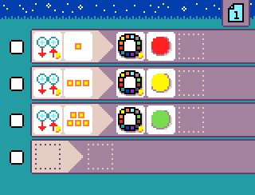

title: Don't stand too close to me!
image: ./docs/images/generated/sample_don't_stand_too_close_me.png
description: Detect dry soil and add waiter

---

{:class="sample"}

This program uses two Jacdac modules:

-   a distance sensor to detect how far an object is
-   an LED ring to show the distance (green for far, yellow for medium, red for close)
