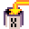
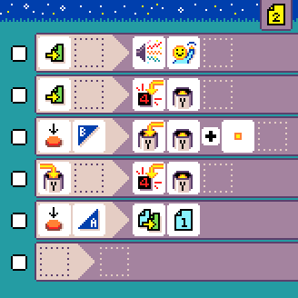

# Double Counter

{:class="sample"}

This program counts how many times you press `button A` or `button B`.
Page 1 is used to track `A` and page `2` for `B`. This is a more advanced version of the [counter sample](./counter).

## {:class="icon"} page 1

{:class="sample"}

This page implements a counter using variable `X`
and {:class="icon"} button `A`. When {:class="icon"} button `B` is pressed, we switch to {:class="icon"} page 2.

{:class="rule"}

-   **when** {:class="icon"} press {:class="icon"} button A, **do** {:class="icon"} set variable `X` to {:class="icon"} variable `X` plus {:class="icon"} `value 1`

{:class="rule"}

-   **when** {:class="icon"} variable X changed, **do** show variable `X` value.

## {:class="icon"} page 2

{:class="sample"}
