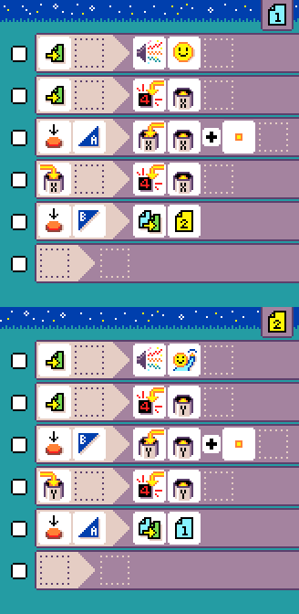
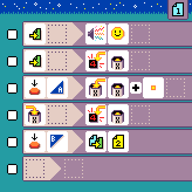
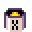

{:class="sample"}

This program counts how many times you press `button A` or `button B`.

-   [Open in MicroCode](/microcode/#H4sIANizQWMAA6VRy27CMBD8pQBNqxxxFIW1cKJgQx63QopwakqlgGLz9XXsVBAjTpxWs5qdndn9UrjbHYOfKt4cofn9ADHnqTjrCkMlurZ8fY14QTueUXjPFUaE43oZ4kTPbOHbk2l+OOwWyAcxCZYLzVeGxwg1PGR5kSThaE6RSOsWXqt9MNMTRIHwWs01ezMmkMWlwauGGB/M+khIgxBwjVnp6vjZy7tt5hU3u+LEmbdZz8GgQfv+nZYca8HYNxOnKpftVuF6T+XzO7O5mzd8uLH9xX9OP7M4trj0rA/P6DMGXcahx1NXJ11bjy/sHjI/+ZX+R591vxk0+rvOnPvNJjdOiKdVga+feXCB5sTrBi6Ev8mE4uAPhFD/6bgCAAA=)

Page 1 is used to track `A` and page `2` for `B`. This is a more advanced version of the [counter sample](./counter).

## {:class="icon"} page 1

{:class="sample"}

This page implements a counter using variable `X`
and {:class="icon"} button `A`. When {:class="icon"} button `B` is pressed, we switch to {:class="icon"} page 2.

To get started, we play a sound and show the value of variable `X`.

{:class="rule"}

-   when page start, play happy sound

{:class="rule"}

-   when page start, show value of variable `X`

The next two rules, implement a counter using the variable `X` and button `A`.

{:class="rule"}

-   **when** {:class="icon"} press {:class="icon"} button A, **do** {:class="icon"} set variable `X` to {:class="icon"} variable `X` plus {:class="icon"} `value 1`

{:class="rule"}

-   **when** {:class="icon"} variable X changed, **do** show variable `X` value.

Finally, the last rule switches to page 2 to have the other counter.

{:class="rule"}

-   when press button B, switch to page 2

## {:class="icon"} page 2

{:class="sample"}

The second page is similar to page 1 but you replace button `A` with button `B`, variable `X` with `Y` and page `2` with page `1`.
