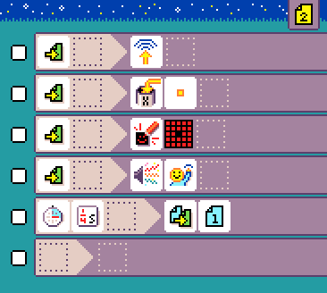

# {:class="icon-sample"} Firefly {#firefly}

{:class="sample"}

Fireflies in the wild synchronize their glowing although there is no leader to give the tempo.
Go to [http://ncase.me/fireflies/](http://ncase.me/fireflies/) and read about the fireflies synchronization phenomenon.

Just like fireflies in the wild, you can create program that synchronize blinking
between any number of micro:bit! The firefly program uses two pages, page 1 will run when the light is off
and page 2 will handle a glow. **You will need 3 micro:bit to make the synchronization work!**

## {:class="icon"} page 1

{:class="sample"}

In {:class="icon"} page 1, we add a rule that clears the screen and keeps a dot {:class="icon"} when the page starts.

{:class="rule"}

The clock of the firefly will be held in {:class="icon"} variable `X`. It starts at {:class="icon"} 1 and once it reaches 8, the firefly will glow.

The {:class="icon"} `radio receive` moves the clock by 1 whenever a neighboring firefly sent a message.

{:class="rule"}

The {:class="icon"} `timer` rule moves the clock every {:class="icon"} quarter of a second;

{:class="rule"}

The next rule, {:class="icon"} **when** variable `X` changed to 8, transitions to {:class="icon"} page 2 when the clock reaches `8`.

{:class="rule"}

Since it is possible that we miss the number `8` because the firefly received many radio updates at once,
we add one last rule, a `timer every 3s` that transitions to page 2.

{:class="rule"}

## {:class="icon"} page 2

{:class="sample"}

A radio message is sent to other firefly so that they can nudge their clock ({:class="icon"}).

{:class="rule"}

The variable `X` is {:class="icon"} set to {:class="icon"} 1.

{:class="rule"}

All the LEDs are turned on.

{:class="rule"}

A sound is played.

{:class="rule"}

After half a second, we transition back to page 1 to restart the non-glow phase.

{:class="rule"}

## improvement ideas

-   use a radio group to avoid interference with other users
-   remix this technique with other programs to create new synchronized experiences!

