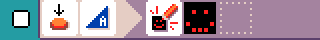

# {:class="icon-sample"} First program

{:class="sample"}

When you select **new program** and keep pressing **A**
in the editor after selecting the new program sample.

The program has one rule that paints a smiley when button A (on the micro:bit) is pressed.

{:class="rule"}

-   **when** {:class="icon"} press {:class="icon"} button A, **do** {:class="icon"} show image smiley.

## improvement ideas

-   keep adding images to create an animation
-   checkout the [smiley buttons](#smiley-buttons) sample to see how to handle button B.
