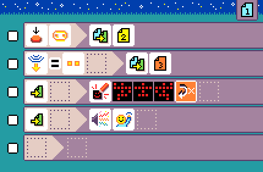
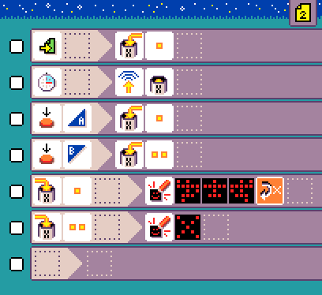
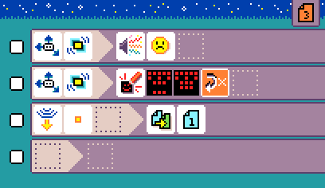

{:class="sample"}

This is the classic 'green light, red light' game where players to try to reach the leader without being caught moving
while the 'light is red'. This is a game played with multiple micro:bit. The leader presses on the logo to enter leader mode, and press button A or B to switch between green and red mode. The current game mode is transmitted via radio
so that every player micro:bit knows when it has to start checking for movement.

-   [Open in MicroCode](/microcode/#H4sIAFhvSWMAA9VUy3KCMBT9JfDRlkUXihma1OAowddOpY7B+JhBB+Hrm6c1SIfpsotMuNyTc2/OufBVoHxz8I7LYHqA6fkVsh4dsQvfod4x3zMal5DOo5yOI/gyK1AfRygZ+ijgZ9Zwv2hD5mRw70gsIRw7dzLOTWSeYZ0HMj8mQHJNqOQKRoorVFxOCZnrDT94zULmia7VV3ng2rWA+zkAOSY9vsCNrxyr+Od50DtDmmuswFWwA4Pl75+xIqdWFUsMFjb1XFR67q6CabYO3pRObTfZRrcazZVORvNRrGKi4jCkSJ8z+LGFF/kHXQsM+HnbF92X8YX1VbyQ8STFDfXsmTD9GV9D36rPZ8DWyODv/doz1fkPPjfcoVt7B8Ft7vIcn1WNi6e9igTXg2e8h0fPlAdGc0yS7aa1261aseUdJqxczPh82P5XuNSZZq74ZGl190DqqjT391R4/ztWvNN4gxXz9pf/hj1ft1rd9Le1nfKcj1rLOSpXM+8K0xNNUngN/U4Oj877N3Hy4qYIBQAA)

## {:class="icon"} page 1

{:class="sample"}

This is the green light player mode page.

{:class="rule"}

-   Put game in leader mode (page 2) when pressing the logo.

{:class="rule"}

-   Put game in 'red light' mode (page 3) when received radio value `2`

{:class="rule"}
{:class="rule"}

-   when the page starts, play sound and show running person animation

## {:class="icon"} page 2

{:class="sample"}

This is the leader mode page.

## {:class="icon"} page 3

{:class="sample"}

This is the player red light page. The player looses if moving in this phase.

{:class="rule"}
{:class="rule"}

-   when shake is detected, show game over animation and play unhappy sound

{:class="rule"}

-   go back to `green light` mode, when radio value 1 is received
