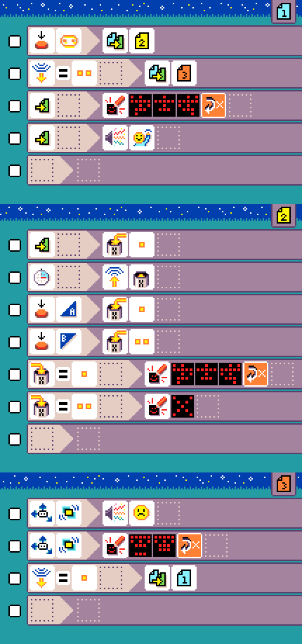
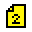
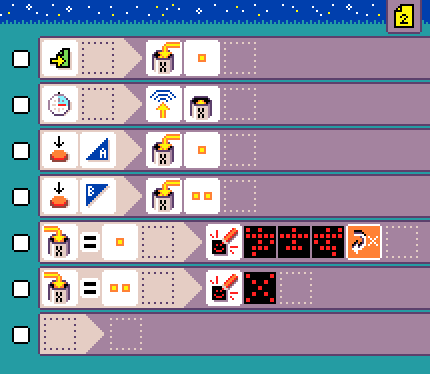

# Green light red light

{:class="sample"}

This is the classic 'green light, red light' game where players to try to reach the leader without being caught moving
while the 'light is red'. This is a game played with multiple micro:bit. The leader presses on the logo to enter leader mode, and press button A or B to switch between green and red mode. The current game mode is transmitted via radio
so that every player micro:bit knows when it has to start checking for movement.

-   [Open in MicroCode](/microcode/#H4sIAKOMR2MAA9VTTXOCMBD9S4Da1oMHPxgaamCQ4NdNsYzRaJnBGYRf3ySbqEE7nHvIhM2+vN28t3xXfpme+ue1Nz+hQ/6O2JCG7MJ3pHbM94ImNaLLuKRRjN4WlT/Csb+bjn2P39mi46qDmFWgoyWxhHDs0io4N5F5hlXelfmIuJJrRiWXFwJXAFxWjZjdn37ympXME1VrBHnXNmu59tfELTEZ8uVe+SoxxPfvyTBHtFRYgWtgJxrLz5+xIgeriSUai9p6rho99zbevNh6H6BTx95l8fWF5qCT1jxMICYQBwH11T2Njwy8yD/oWmGX3zd9UX1pX9gI4pWMZwfcUs+cCd2f9jUYG/X5DJgaafytX3Omuv/B55Y39F6+QXDrtzzHOdS49JVXseB68Iz38OgZeKA1x2SXpc5+v3ESwztMWL1a8Pkw/W9wwZ12ruTH0OrmgdQVNB8fqfD+b6w4U3iNFfP24n/I5nc90HnN0nOQb50uDanvYNqtp4eUZtFg8At6riDOzAQAAA==)

## {:class="icon"} page 1

{:class="sample"}

This is the green light player mode page.

{:class="rule"}

-   Put game in leader mode (page 2) when pressing the logo.

{:class="rule"}

-   Put game in 'red light' mode (page 3) when received radio value `2`

{:class="rule"}
{:class="rule"}

-   when the page starts, play sound and show running person animation

## {:class="icon"} page 2

{:class="sample"}

This is the leader mode page.

## {:class="icon"} page 3

{:class="sample"}

This is the player red light page. The player looses if moving in this phase.

{:class="rule"}
{:class="rule"}

-   when shake is detected, show game over animation and play unhappy sound
