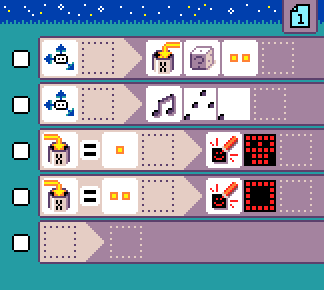

# {:class="icon-sample"} Head or tail

{:class="sample"}

Flip a virtual coin and show head or tail when the micro:bit is shaken.

The program starts with a rule that uses
a shake event and 2-face dice is cast. The result is stored in variable `X`.

{:class="rule"}

-   **when** {:class="icon"} {:class="icon"} shake, **do** {:class="icon"} set variable X to {:class="icon"} random number between 1 and {:class="icon"} 3.

The next 2 rules match the value passed in variable `X`
and display a different symbol for each value, 1 or 2.

{:class="rule"}

-   **when** {:class="icon"} variable `X` changes to {:class="icon"} 1, **do** {:class="icon"} show head image.

{:class="rule"}

-   **when** {:class="icon"} variable `X` changes to {:class="icon"} 2, **do** {:class="icon"} show tail image.

## improvement ideas

-   add sound emoji whenever shake happens
-   clear the screen before showing the new symbol

## Video

<video class="sample" poster="../videos/head-or-tail.png" src="../videos/head-or-tail.mp4" controls="true"></video>
