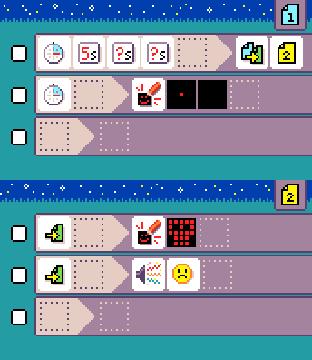
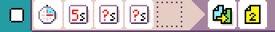
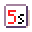

# {:class="icon-sample"} Hot potato

{:class="sample"}

Pass the hot potato around and make
sure it does not beep while you have it
in your hands!

## {:class="icon"} page 1

{:class="sample"}

The first page of the program is a random timer of 5 to 6 seconds.
Once the timer triggers, the first rule {:class="icon"} switches to {:class="icon"} page 2.

{:class="rule"}

-   **when** {:class="icon"} time
    of {:class="icon"} 5s
    and {:class="icon"} 1
    random second, **do** {:class="icon"} switches to {:class="icon"} page 2.

## {:class="icon"} page 2

{:class="sample"}

On this page, we should a skull image and play a sad sound on start.
If the **when** section is empty, the rule runs once at the page start only.

{:class="rule"}

-   **when** {:class="icon"} page start, **do** {:class="icon"} show image skull.

{:class="rule"}

-   **when** {:class="icon"} page start, **do** {:class="icon"} play sound emoji {:class="icon"} sad.

## improvement ideas

-   add sound emoji when timer expires
-   add a better expired potato animation
