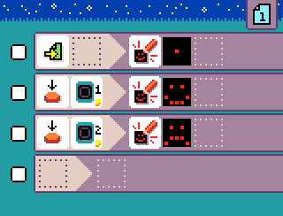

{:class="sample"}

This program requires a [Jacdac keycap button module](https://microsoft.github.io/jacdac-docs/devices/kittenbot/keycapbuttonv10/).

The program reacts to presses of two external keys.

-   [Open in MicroCode](/microcode/#H4sIAKCjLGUAA/NKywwOSM8vznd0DHR0dPQJrqxMD/T0AHJLfH28nRwdg5KdHANdQdgRAO3GOg8sAAAA)
