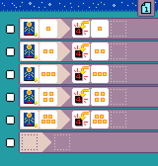

{:class="sample"}

This program requires a [Jacdac light sensor module](https://microsoft.github.io/jacdac-docs/devices/kittenbot/lightsensorv10/).
The light sensor tile maps the amount of light to values 1-5, where 1 means no light and 5 is a lot of light.

-   [Open in MicroCode](/microcode/#eyJwcm9nZGVmIjp7IlAiOlt7IlIiOlt7IlMiOlsiUzUiXSwiQSI6WyJBMTAiXSwiRiI6WyJGOCJdLCJNIjpbIk02Il19LHsiUyI6WyJTNSJdLCJBIjpbIkExMCJdLCJGIjpbIkY5Il0sIk0iOlsiTTciXX0seyJTIjpbIlM1Il0sIkEiOlsiQTEwIl0sIkYiOlsiRjEwIl0sIk0iOlsiTTgiXX0seyJTIjpbIlM1Il0sIkEiOlsiQTEwIl0sIkYiOlsiRjExIl0sIk0iOlsiTTkiXX0seyJTIjpbIlM1Il0sIkEiOlsiQTEwIl0sIkYiOlsiRjEyIl0sIk0iOlsiTTEwIl19LHt9XX0seyJSIjpbe31dfSx7IlIiOlt7fV19LHsiUiI6W3t9XX0se31dfSwidmVyc2lvbiI6InYyLjQuMjgifQ)

## {:class="icon"} Light level events

We have a rule for each value of the light level (1..5). Each rule shows the corresponding value on the screen.

{:class="rule"}

-   **when** {:class="icon"} equals 1, **do** show number 1.