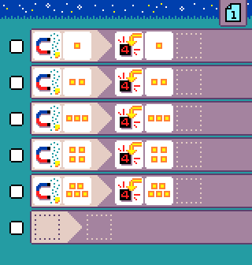

{:class="sample"}

This program requires a [Jacdac magnet sensor module](https://microsoft.github.io/jacdac-docs/devices/kittenbot/magnetsensorv10/).
The magnet sensor tile maps the strength of the magnetic field to values 1-5, where 1 means no magnetic field detected and 5 is strong presence of magnetic field. The program simply displays the magnetic field level on the LED screen.

-   [Open in MicroCode](/microcode/#eyJwcm9nZGVmIjp7IlAiOlt7IlIiOlt7IlMiOlsiUzEwIl0sIkEiOlsiQTEwIl0sIkYiOlsiRjgiXSwiTSI6WyJNNiJdfSx7IlMiOlsiUzEwIl0sIkEiOlsiQTEwIl0sIkYiOlsiRjkiXSwiTSI6WyJNNyJdfSx7IlMiOlsiUzEwIl0sIkEiOlsiQTEwIl0sIkYiOlsiRjEwIl0sIk0iOlsiTTgiXX0seyJTIjpbIlMxMCJdLCJBIjpbIkExMCJdLCJGIjpbIkYxMSJdLCJNIjpbIk05Il19LHsiUyI6WyJTMTAiXSwiQSI6WyJBMTAiXSwiRiI6WyJGMTIiXSwiTSI6WyJNMTAiXX0se31dfSx7IlIiOlt7fV19LHsiUiI6W3t9XX0seyJSIjpbe31dfSx7fV19LCJ2ZXJzaW9uIjoidjIuNC4yOCJ9)
