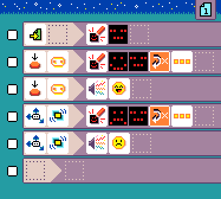
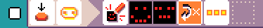

{:class="icon-sample"}

{:class="sample"}

Keep your micro:pet happy by petting
its head (Logo) and don't shake it, it does not like that.

{:class="rule"}

-   **when** {:class="icon"} page started, **do** {:class="icon"} show image neutral mood

Touching the micro:bit logo makes it happy.

{:class="rule"}

-   **when** {:class="icon"} press {:class="icon"} micro:bit logo, **do** {:class="icon"} show image happy animation and {:class="icon"} repeat {:class="icon"} 3 times.

{:class="rule"}

-   **when** {:class="icon"} press {:class="icon"} micro:bit logo, **do** {:class="icon"} play sound emoji {:class="icon"} giggle.

Shaking makes it unhappy.

{:class="rule"}

-   **when** {:class="icon"} {:class="icon"} shake, **do** {:class="icon"} show image unhappy animation and {:class="icon"} repeat {:class="icon"} 3 times.

{:class="rule"}

-   **when** {:class="icon"} {:class="icon"} shake, **do** {:class="icon"} play sound emoji {:class="icon"} sad.

## improvement ideas

-   use more rules to manipulate the mood of your pet
