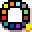
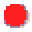
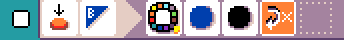

# {:class="icon-sample"} Railroad crossing

{:class="sample"}

This program controls a railroad crossing. This sample is using [Jacdac](https://aka.ms/jacdac) modules to extend the micro:bit with programmable LEDs, servo and other sensors/actuators.

The {:class="icon"} `servo` uses a [servo motor](https://microsoft.github.io/jacdac-docs/services/servo/) move to move an physical arm. The {:class="icon"} `servo` arm orientation is mapped to the wall clock hours: `0` (or `12`) is on rotated 90 degree from the resting position to the left, `6` is rotated 90 degree right from the rest position.
There is also a secret animation mode when you press the micro:bit logo button.

{:class="rule"}

-   **when** {:class="icon"} press {:class="icon"} button A, **do** {:class="icon"} servo set arm to 1 o'clock.

{:class="rule"}

-   **when** {:class="icon"} press {:class="icon"} button B, **do** {:class="icon"} servo set arm to 5 o'clock.

The {:class="icon"} `LED` uses a [programmable LED ring](https://microsoft.github.io/jacdac-docs/services/led/) module to display blue and red colors.

{:class="rule"}

-   **when** {:class="icon"} press {:class="icon"} button A, **do** {:class="icon"} LED set all color to {:class="icon"} red, black and repeat.

{:class="rule"}

-   **when** {:class="icon"} press {:class="icon"} button B, **do** {:class="icon"} LED set all color to {:class="icon"} blue, black and repeat.

{:class="rule"}

-   **when** {:class="icon"} press {:class="icon"} button B, **do** {:class="icon"} LED show rainbow animation.

<video class="sample" poster="../videos/jacdac-led.png" src="../videos/jacdac-led.mp4" controls="true"></video>
