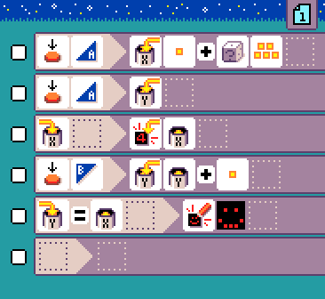

{:class="sample"}

When you press the A button, this program sets variable `X` to a random number between 2 and 6, sets variable `Y` to zero, and
then displays the value of variable `X`. Each time you press the B button, the value of variable `Y` is increased by one.
When the value of variable `Y` becomes equal to the value of variable `X`, a smiley face is shown.

-   [Open in MicroCode](/microcode/#eyJwcm9nZGVmIjp7IlAiOlt7IlIiOlt7IlMiOlsiUzIiXSwiQSI6WyJBOUEiXSwiRiI6WyJGMyJdLCJNIjpbIk02IiwiTTIyIiwiTTEwIl19LHsiUyI6WyJTMiJdLCJBIjpbIkE5QiJdLCJGIjpbIkYzIl19LHsiUyI6WyJTOUEiXSwiQSI6WyJBMTAiXSwiTSI6WyJNMjBBIl19LHsiUyI6WyJTMiJdLCJBIjpbIkE5QiJdLCJGIjpbIkY0Il0sIk0iOlsiTTIwQiIsIk02Il19LHsiUyI6WyJTOUIiXSwiQSI6WyJBNSJdLCJGIjpbIkYyMEEiXSwiTSI6WyJNMTUoMDAwMDAwMTAxMDAwMDAwMTAwMDEwMTExMCkiXX0se31dfSx7IlIiOlt7fV19LHsiUiI6W3t9XX0seyJSIjpbe31dfSx7fV19LCJ2ZXJzaW9uIjoidjIuNC4yNyJ9)
