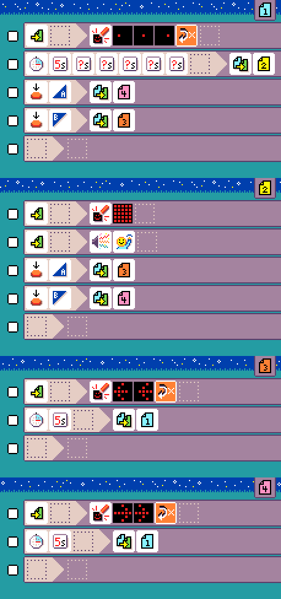
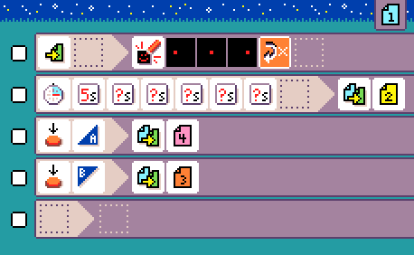
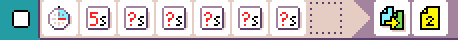
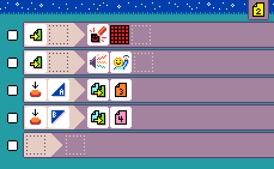
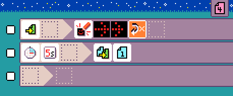

{:class="icon-sample"}

{:class="sample"}

This is a 2 player game that tests your reaction time. In this game, both player wait for a signal (screen image, sound)
to press the button. The fastest player that presses the button **after** wins the round. You loose if you press before.

This program uses 4 pages:

-   page 1: countdown,
-   page 2: wait for player to press button
-   page 3: player left won
-   page 4: player right won

## {:class="icon"} page 1

{:class="sample"}

This is the page where players see a "loader animation"
and wait for the signal.

{:class="rule"}

After 5s + 5 random seconds, we switch to page 2.

{:class="rule"}

If any player presses A early, we transition to page 4 since
player B won.

{:class="rule"}

Same for the button B

{:class="rule"}

## {:class="icon"} page 2

{:class="sample"}

This is the active game page where players have to react as fast as possible.

Players receive the signal as LEDs on and a sound.

{:class="rule"}

{:class="rule"}

Then we add rules to switch pages on button press, but unlike page 1, pressing means you win!

{:class="rule"}

{:class="rule"}

## {:class="icon"} page 3

Player A victory page.

{:class="sample"}

The page shows an animation showing left arrows.

{:class="rule"}

And the game restart after 5 seconds.

{:class="rule"}

## {:class="icon"} page 4

Player B victory page, similar to page 3.

{:class="sample"}

## improvement ideas

-   Use touch pin 0 or 1 instead of button A, B as inputs.

## See Also

-   [MakeCode project](https://makecode.microbit.org/projects/reaction-time)
