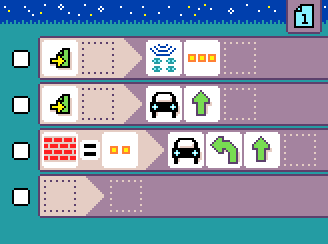

{:class="sample"}

-   [Open in MicroCode](/microcode/#H4sIAKCjLGUAA/NKywwOSM8vzQvMNyjLyAnw83XWdgx0dQJiRwDDSNcqHAAAAA==)

The program starts by setting the radio group displayed by the [robot micro:bit](../robot.md). This is the same group that the microcode program will use to communicate with the robot. In this example, we use 3 dots but this is probably different for your robot.

{:class="rule"}

-   **when** {:class="icon"} page starts, **do**  set radio group to **put your robot radio number!**

The next rule runs on start and orders the robot to move forward. The robot will keep moving forward until another commands is received.

{:class="rule"}

The robot constantly reports the distance measured by
the ultrasonic sonar. When the distance changes, the robot sends a message to the microcode program.
The 2 dots roughly mean 10cm + 2 x 5cm = 20cm (more or less).

{:class="rule"}
