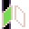

{:class="sample"}

-   [Open in MicroCode](/microcode/#H4sIAOy8M2UAA/NKywwOSM8vzQsqyPfzMUmMygpxdM9NNigPKijw8w11cgx0BWJHWwDRJhkiKAAAAA==)

The program starts by setting the radio group displayed by the [robot micro:bit](../robot.md). This is the same group that the microcode program will use to communicate with the robot. In this example, we use 3 dots but this is probably different for your robot.

{:class="rule"}

-   **when** {:class="icon"} page starts, **do**  set radio group to **put your robot radio number!**

Microcode assumes that the robot has 2 line sensors at the front of the robot (some have more). Each following rule handle one possible state of the sensor and tell the robot where to go accordingly.

{:class="rule"}

When  both lines are detected,  move the robot forward.

{:class="rule"}

When the  left sensor detects the line, the robot is starting to lose the line trajectory and we tell the robot to  turn left.

{:class="rule"}

The same logic is applied for the right sensor.

{:class="rule"}

When the  left sensor also stops detecting the line, the robot completely lost the line but we know that the line was on the left. We tell the robot to  spin right (harder turn) to aggressively go back to detecting the line.

{:class="rule"}

The same logic is applied for the right sensor.

## Tips about line following

-   the line should be as wide as the distance between the 2 sensors
-   use a chalk marker to draw the line on the mat as the infrared line sensor will be able to "see it". Some markers will be invisible to the sensor
-   avoid sharp turns as the robot will have a hard time following the line. Microcode lowers the speed of the robot
    when it detects line crossing but it is sometimes not enough.
