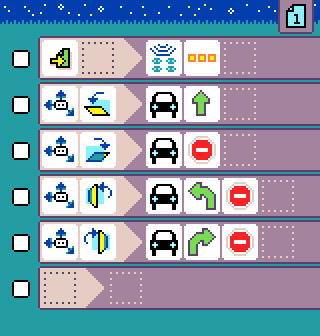

{:class="sample"}

-   [Open in MicroCode](/microcode/#eyJwcm9nZGVmIjp7IlAiOlt7IlIiOlt7IlMiOlsiUzEiXSwiQSI6WyJBNkEiXSwiTSI6WyJNOCJdfSx7IlMiOlsiUzMiXSwiQSI6WyJDQVIiXSwiRiI6WyJGMTdfdGlsdF9kb3duIl0sIk0iOlsiQ0FSMSJdfSx7IlMiOlsiUzMiXSwiQSI6WyJDQVIiXSwiRiI6WyJGMTdfdGlsdF91cCJdLCJNIjpbIkNBUjUiXX0seyJTIjpbIlMzIl0sIkEiOlsiQ0FSIl0sIkYiOlsiRjE3X3RpbHRfbGVmdCJdLCJNIjpbIkNBUjMiLCJDQVI1Il19LHsiUyI6WyJTMyJdLCJBIjpbIkNBUiJdLCJGIjpbIkYxN190aWx0X3JpZ2h0Il0sIk0iOlsiQ0FSNCIsIkNBUjUiXX0se31dfSx7IlIiOlt7fV19LHsiUiI6W3t9XX0seyJSIjpbe31dfSx7fV19LCJ2ZXJzaW9uIjoidjIuNC40MyJ9)

The program starts by setting the radio group displayed by the [robot micro:bit](../robot.md). This is the same group that the microcode program will use to communicate with the robot. In this example, we use 3 dots but this is probably different for your robot.

{:class="rule"}

-   **when** {:class="icon"} page starts, **do**  set radio group to **put your robot radio number!**

The next rule runs when the micro:bit is tilted forward and orders the robot to move forward. The robot will keep moving forward until another commands is received.

{:class="rule"}

Similarly, the next rule tells to the robot to stop when
the micro:bit is tilted backward.

{:class="rule"}

When the micro:bit tilts left, tell the robot to turn left then stop.

{:class="rule"}

When the micro:bit tilts right, tell the robot to turn right then stop.

{:class="rule"}
