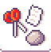

# {:class="icon-sample"} Rock Paper Scissors {#rock-paper-scissors}

{:class="sample"}

The classic game of rock paper scissors
where the micro:bit display a different
symbol when shaken.

The program starts with a rule that uses
a shake event and 3-face dice is cast. The result is stored in variable `X`.

{:class="rule"}

-   **when** {:class="icon"} {:class="icon"} shake, **do** {:class="icon"} set variable X to {:class="icon"} random number between 1 and {:class="icon"} 3.

The next 3 rules match the value passed in variable `X`
and display a different symbol for each value, 1, 2 or 3.

{:class="rule"}

-   **when** {:class="icon"} variable `X` changes to {:class="icon"} 1, **do** {:class="icon"} paint screen with paper.

{:class="rule"}

-   **when** {:class="icon"} variable `X` changes to {:class="icon"} 2, **do** {:class="icon"} paint screen with rock.

{:class="rule"}

-   **when** {:class="icon"} variable `X` changes to {:class="icon"} 3, **do** {:class="icon"} paint screen with scissors.

## improvement ideas

-   add sound emoji whenever shake happens
-   clear the screen before showing the new symbol
